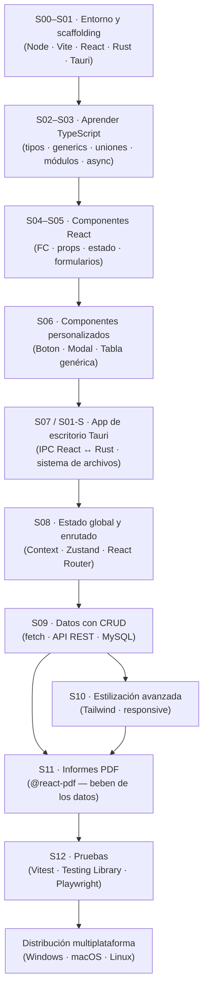

# Desarrollo de Interfaces con React + Tauri

**Segundo curso de Desarrollo de Aplicaciones Multiplataforma**

---

## Índice / Navegación

- [Sesiones del curso](sesiones/index.md) — guion S00–S12 con teoría por sesión
- [Repositorios de código y plan de sesiones](REPOS.md) — repos `01`–`05`, sesiones y proyecto final
- [Ejercicios por sesión con soluciones](ejercicios/) — batería de ejercicios S00–S12
- [Proyecto final: AppCine](sesiones/temario-appcine.md)

---

## 1. Contexto Teórico y Evolución de las Interfaces Web

### 1.1 El Modelo Tradicional (Server-Side Rendering)

En los inicios de la web, las interfaces funcionaban bajo un modelo estrictamente basado en el servidor. Cada acción del usuario, como un clic o el envío de un formulario, requería una petición HTTP completa. El servidor procesaba la solicitud, reconstruía el documento HTML desde cero y lo enviaba de vuelta. Esto provocaba una recarga total de la página web, interrumpiendo la experiencia del usuario y consumiendo un ancho de banda innecesario.

### 1.2 El DOM Real (Document Object Model)

El DOM real es la interfaz de programación de aplicaciones que los navegadores utilizan para representar internamente las páginas web como un árbol de objetos. Aunque el motor de JavaScript del navegador es extremadamente rápido, interactuar directamente con el DOM real para realizar modificaciones estructurales es costoso y lento debido a los procesos de reflow y repaint.

### 1.3 La Revolución de React y el Virtual DOM

Para solucionar esta ineficiencia, surge React introduciendo el concepto de Virtual DOM. El Virtual DOM es una copia ligera y en memoria del DOM real. El flujo de actualización funciona de la siguiente manera: cuando los datos cambian, React genera un nuevo árbol del Virtual DOM. Luego, usa un algoritmo para comparar este nuevo árbol con la versión anterior e identificar qué nodos han cambiado. Finalmente, aplica únicamente los cambios mínimos necesarios directamente sobre el DOM real, garantizando una fluidez y rendimiento óptimos.

---

## 2. Ecosistema de Tecnologías e Integración

Para construir una aplicación de escritorio moderna y ligera, se entrelazan herramientas del ecosistema frontend y del ecosistema de sistemas:

| Tecnología | Descripción |
|---|---|
| **Node.js** | El entorno de ejecución de JavaScript en el lado del servidor, necesario para ejecutar las herramientas de desarrollo. |
| **NPM** | El gestor que administra e instala todas las librerías, dependencias y paquetes del proyecto. |
| **Vite** | El empaquetador y servidor de desarrollo moderno que ofrece recargas instantáneas. |
| **React** | La librería encargada de la lógica de la interfaz, el estado de los componentes y la reactividad visual utilizando TypeScript. |
| **Tailwind CSS** | Un framework de CSS utilitario que permite diseñar interfaces rápidas y consistentes aplicando clases directamente en el HTML o JSX. |
| **Rust** | El lenguaje que da soporte al backend de Tauri, destacando por su seguridad en memoria y su velocidad. |
| **Tauri** | El puente que une todo, exponiendo una API segura en Rust para comunicarse con el sistema operativo. |

---

## 3. Hoja de Ruta del Curso

**De TypeScript a una aplicación de escritorio multiplataforma.** El curso encadena cuatro bloques (fundamentos → UI → app de escritorio → producto final): primero se aprende TypeScript, con ello se construyen componentes React, sobre esos componentes se monta una app de escritorio con Tauri, y el resultado se cierra con informes PDF que consumen los datos, pruebas y distribución multiplataforma.



---

## 4. Distribución Temporal y Contenidos (S00–S12)

| # | Sesion | Titulo | Contenido |
|---|--------|--------|-----------|
| 0 | [S00](sesiones/sesion00.md) | Fundamentos de Arquitectura y Configuración del Entorno | nvm, Node.js, NPM, Vite, React, Tailwind CSS, Rust, Tauri (panoramica) |
| 1 | [S01](sesiones/sesion01.md) | Instalación del Entorno de Desarrollo | Windows, Ubuntu/Debian, macOS, Fedora/Arch, desinstalacion |
| 1-S | [S01-S](sesiones/sesion01_scaffolding.md) | Scaffolding de un Proyecto Tauri con React y Rust | Estructura archivos, Cargo.toml, tauri.conf.json, invoke, IPC |
| 2 | [S02](sesiones/sesion02.md) | Introducción a TypeScript (Parte 1) | Tipos primitivos, arrays y tuplas, any/unknown/never/void, aserciones, inferencia, uniones e intersecciones, literal types y narrowing, interfaces, type aliases, funciones, type guards, operadores, control de flujo, ámbito y scope |
| 3 | [S03](sesiones/sesion03.md) | Introducción a TypeScript (Parte 2) | Generics, utility types, keyof/typeof/satisfies, módulos, strict mode, métodos de arrays, Set y Map, objetos en profundidad, asincronía (async/await, Fetch) |
| 4 | [S04](sesiones/sesion04.md) | Anatomía de Componentes y Funciones con TypeScript | Componentes FC, props, useState, useEffect, closures, composicion |
| 5 | [S05](sesiones/sesion05.md) | Gestión de Estado Básico y Tipado de Formularios | useReducer, formularios, validacion, localStorage, patrones de estado |
| 6 | [S06](sesiones/sesion06.md) | Creación de Componentes Personalizados | ButtonHTMLAttributes, Table generica, Modal, composicion, slots |
| 7 | [S07](sesiones/sesion07.md) | El Puente de Comunicación (Tauri IPC) y Sistema de Archivos | Comandos Rust, invoke(), eventos, std::fs, Fetch CRUD |
| 8 | [S08](sesiones/sesion08.md) | Persistencia de Estado Global y Enrutado | Context API, Zustand, persist, React Router v6, SPA custom |
| 9 | [S09](sesiones/sesion09.md) | Formulario CRUD para bases de datos | ApiService generica, GET/POST/PUT/DELETE, validacion |
| 10 | [S10](sesiones/sesion10.md) | Estilización Avanzada y Diseño de Interfaces con Tailwind CSS | Responsive, grid, hamburger menu, animaciones |
| 11 | [S11](sesiones/sesion11.md) | Creación de Informes en PDF con React | @react-pdf/renderer, Document/Page/Text, PDFViewer |
| 12 | [S12](sesiones/sesion12.md) | Prueba Automatizada | Vitest, Testing Library, Playwright E2E, ejercicios TS |

---

## 5. Estructura General del Proyecto (React + Tauri)

- **Raíz del proyecto**: archivos como `package.json` (dependencias JavaScript), `vite.config.ts` (empaquetador) y `tsconfig.json` (TypeScript).
- **Frontend** (`src/`): archivos como `App.tsx` e `index.css`.
- **Backend** (`src-tauri/`): lógica en Rust, incluyendo `tauri.conf.json`.

---

## 6. Creación de Informes en PDF con React

Utilizando la librería [@react-pdf/renderer](https://github.com/diegomura/react-pdf), es posible generar informes en PDF directamente desde componentes React. Esta solución permite definir la estructura del documento de forma declarativa, garantizando un control preciso sobre la paginación y el diseño, independientemente del CSS utilizado en la interfaz.

---

## 7. Operaciones CRUD con MySQL y API REST

Para implementar un formulario CRUD conectado a una base MySQL mediante una API REST:

- Se utiliza el hook `useEffect` para manejar la carga inicial desde el servidor.
- Las operaciones se gestionan mediante llamadas asíncronas con `fetch` o `axios`.
- El estado se mantiene sincronizado con la base a través del backend.

```typescript
// Obtener datos
const fetchUsers = async () => {
  const response = await fetch('https://api.example.com/users');
  const data = await response.json();
  setUsers(data);
};

// Crear un nuevo registro
const addUser = async (newUser: User) => {
  const response = await fetch('https://api.example.com/users', {
    method: 'POST',
    headers: { 'Content-Type': 'application/json' },
    body: JSON.stringify(newUser),
  });
  if (response.ok) { fetchUsers(); }
};
```

---

## 8. Creación de Componentes Personalizados

### 8.1 Definición y Reutilización con Props

Las props permiten pasar datos desde un componente padre a uno hijo, haciendo que pueda mostrar información distinta según los datos recibidos.

### 8.2 Tipado con TypeScript

Es fundamental definir una interfaz para las props, asegurando que el componente reciba exactamente lo que necesita, previniendo errores en tiempo desarrollo y facilitando el mantenimiento del código.

### 8.3 Composición Interfaces

La composición permite combinar componentes simples para construir interfaces complejas.Piezas pequeñas especializadas ensambladas entre sí mejoran la legibilidad y facilitan las pruebas unitarias.

---

## 9. Atribución

La teoría TypeScript del curso (Sesiones 2 y 3), han sido adaptados a partir del material de JavaScript *"Apuntes DWEC"* perteneciente a **Isaías Fernández Lozano (Profe)** y se distribuye bajo **Creative Commons CC BY 4.0** 

# DI-REACT-TAURI
Repositorio creado por **José María Molina** para el curso DI de 2º DAM 
IES Politécnico Hermenegildo Lanz# DI-REACT-TAURI
