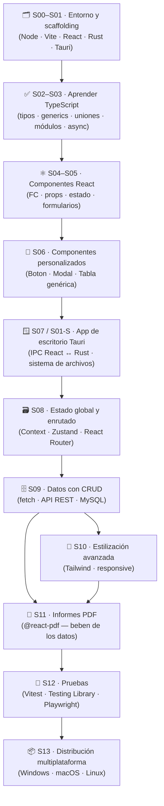

#  Desarrollo de Interfaces con React + Tauri 

**Segundo curso de Desarrollo de Aplicaciones Multiplataforma**

---

## Índice / Navegación

- [Sesiones del curso](sesiones/index.md) — guion S00–S12 con teoría por sesión
- [Repositorios de código y plan de sesiones](REPOS.md) — repos `01`–`05`, sesiones y proyecto final
- [Ejercicios por sesión con soluciones](ejercicios/) — batería de ejercicios S00–S12
- Proyecto final: AppCine

---

## 1. Contexto Teórico y Evolución de las Interfaces Web

Las interfaces web han evolucionado de un modelo servidor-céntrico hacia aplicaciones dinámicas ejecutadas en el cliente:

- **1.1 Modelo tradicional (Server-Side Rendering):** cada acción del usuario (un clic, el envío de un formulario) requería una petición HTTP completa; el servidor reconstruía el documento HTML desde cero y lo devolvía, provocando recargas totales de la página e interrumpiendo la experiencia.
- **1.2 El DOM real:** el árbol de objetos con el que el navegador representa la página. Aunque los motores JavaScript son muy rápidos, modificarlo directamente es costoso y lento por los procesos de *reflow* y *repaint*.
- **1.3 La revolución de React y el Virtual DOM:** React mantiene una copia ligera del DOM en memoria, compara el nuevo árbol con el anterior mediante un algoritmo de diferencias y aplica únicamente los cambios mínimos necesarios sobre el DOM real, garantizando fluidez y rendimiento óptimos.

### ¿Por qué la tecnología web es tan útil para crear aplicaciones de escritorio?

- **Multiplataforma:** el mismo código HTML/CSS/JS se ejecuta en Windows, macOS y Linux sin reescribir la interfaz para cada sistema operativo.
- **Ecosistema maduro:** acceso a miles de librerías (React, Tailwind CSS, routers, herramientas de testing) que aceleran el desarrollo de la interfaz.
- **Desarrollo rápido:** recarga en caliente (HMR) y depuración en el navegador agilizan el ciclo de diseño, implementación y prueba.
- **Experiencia fluida y ligera:** integrada con Tauri, la interfaz web se empaqueta en una carcasa nativa de Rust con bajo consumo de recursos.
- **Distribución sencilla:** el frontend se compila en instaladores nativos por plataforma mientras conserva el desarrollo web estándar.

---

## 2. Justificación de la asignatura de Desarrollo de Interfaces

La asignatura **Desarrollo de Interfaces** (DI) capacita al alumnado para construir aplicaciones multiplataforma completas, cubriendo el ciclo de vida de la interfaz de usuario:

- **Diseño con usabilidad de GUI y NUI:** planificar interfaces gráficas (GUI) y naturales (NUI) centradas en el usuario, aplicando principios de usabilidad y accesibilidad desde el diseño y el prototipado.
- **Desarrollo:** implementar la interfaz y su lógica mediante tecnologías web modernas —TypeScript, React y Tailwind CSS— integradas en una aplicación de escritorio real mediante Tauri.
- **Documentación:** documentar el diseño, el código y su uso para facilitar el mantenimiento y la evolución del software.
- **Distribución:** empaquetar y distribuir la aplicación final en entornos multiplataforma (Windows, macOS, Linux).
- **Pruebas:** verificar el comportamiento de la interfaz y la lógica con pruebas unitarias (Vitest), de componentes (Testing Library) y de extremo a extremo (Playwright).

---

## 3. Ecosistema de Tecnologías e Integración

Para construir una aplicación de escritorio moderna y ligera, se entrelazan herramientas del ecosistema frontend y del ecosistema de sistemas:

| Tecnología | Descripción |
|---|---|
|  **Node.js** | El entorno de ejecución de JavaScript en el lado del servidor, necesario para ejecutar las herramientas de desarrollo. |
|  **NPM** | El gestor que administra e instala todas las librerías, dependencias y paquetes del proyecto. |
|  **Vite** | El empaquetador y servidor de desarrollo moderno que ofrece recargas instantáneas. |
|  **TypeScript** | El lenguaje de programación que añade tipado estático a JavaScript, aportando seguridad y mantenibilidad al código. |
|  **React** | La librería encargada de la lógica de la interfaz, el estado de los componentes y la reactividad visual utilizando TypeScript. |
|  **Tailwind CSS** | Un framework de CSS utilitario que permite diseñar interfaces rápidas y consistentes aplicando clases directamente en el HTML o JSX. |
|  **Rust** | El lenguaje que da soporte al backend de Tauri, destacando por su seguridad en memoria y su velocidad. |
|  **Tauri** | El puente que une todo, exponiendo una API segura en Rust para comunicarse con el sistema operativo. |

---

## 4. Hoja de Ruta del Curso

**De TypeScript a una aplicación de escritorio multiplataforma.** El curso encadena cuatro bloques (fundamentos → UI → app de escritorio → producto final): primero se aprende TypeScript, con ello se construyen componentes React, sobre esos componentes se monta una app de escritorio con Tauri, y el resultado se cierra con informes PDF que consumen los datos, pruebas y distribución multiplataforma.

### Evaluación

La evaluación de la asignatura se basará en:

- **Trabajo en clase:** seguimiento continuo de las prácticas y actividades realizadas en el aula.
- **Examen de TypeScript:** prueba escrita y/o práctica sobre los contenidos de las sesiones 2 y 3.
- **Examen de React:** prueba escrita y/o práctica sobre componentes y gestión de estado (sesiones 4 a 6).
- **Miniproyecto de Tauri:** desarrollo de una aplicación de escritorio completa integrando todo lo aprendido durante el curso.

---

## 5. Distribución Temporal y Contenidos (S00–S13)

Cada sesión empleará aproximadamente **3 horas** de clase, dedicando el resto del tiempo a la realización de **prácticas** y a la resolución de **dudas**.

| # | RA | Sesion | Titulo | Contenido |
|---|----|--------|--------|-----------|
| 0 | - | [S00](sesiones/sesion00.md) | Fundamentos de Arquitectura y Configuración del Entorno | nvm, Node.js, NPM, Vite, React, Tailwind CSS, Rust, Tauri (panoramica) |
| 1 | - | [S01](sesiones/sesion01.md) | Instalación del Entorno de Desarrollo | Windows, Ubuntu/Debian, macOS, Fedora/Arch, desinstalacion |
| 1-S | - | [S01-S](sesiones/sesion01_scaffolding.md) | Scaffolding de un Proyecto Tauri con React y Rust | Estructura archivos, Cargo.toml, tauri.conf.json, invoke, IPC |
| 2 | RA1 | [S02](sesiones/sesion02.md) | Introducción a TypeScript (Parte 1) | Tipos primitivos, arrays y tuplas, any/unknown/never/void, aserciones, inferencia, uniones e intersecciones, literal types y narrowing, interfaces, type aliases, funciones, type guards, operadores, control de flujo, ámbito y scope |
| 3 | RA1 | [S03](sesiones/sesion03.md) | Introducción a TypeScript (Parte 2) | Generics, utility types, keyof/typeof/satisfies, módulos, strict mode, métodos de arrays, Set y Map, objetos en profundidad, asincronía (async/await, Fetch) |
| 4 | RA1 | [S04](sesiones/sesion04.md) | Anatomía de Componentes y Funciones con TypeScript | Componentes FC, props, useState, useEffect, closures, composicion |
| 5 | RA1 | [S05](sesiones/sesion05.md) | Gestión de Estado Básico y Tipado de Formularios | useReducer, formularios, validacion, localStorage, patrones de estado |
| 6 | RA1 | [S06](sesiones/sesion06.md) | Creación de Componentes Personalizados | ButtonHTMLAttributes, Table generica, Modal, composicion, slots |
| 7 | RA1 | [S07](sesiones/sesion07.md) | El Puente de Comunicación (Tauri IPC) y Sistema de Archivos | Comandos Rust, invoke(), eventos, std::fs, Fetch CRUD |
| 8 | RA1 | [S08](sesiones/sesion08.md) | Persistencia de Estado Global y Enrutado | Context API, Zustand, persist, React Router v6, SPA custom |
| 9 | RA1 | [S09](sesiones/sesion09.md) | Formulario CRUD para bases de datos | ApiService generica, GET/POST/PUT/DELETE, validacion |
| 10 | RA4 | 🤖 [S10](sesiones/sesion10.md) | Estilización Avanzada y Diseño de Interfaces con Tailwind CSS | Responsive, grid, hamburger menu, animaciones |
| 11 | RA5 | 🤖 [S11](sesiones/sesion11.md) | Creación de Informes en PDF con React | @react-pdf/renderer, Document/Page/Text, PDFViewer |
| 12 | RA6 y RA8 | 🤖 [S12](sesiones/sesion12.md) | Documentación y Pruebas Automatizada | Vitest, Testing Library, Playwright E2E, ejercicios TS |
| 13 | RA2 y RA3 | 🤖 [S13](sesiones/sesion13.md) | Distribución Multiplataforma con Tauri | Bundle (tauri.conf.json), instaladores MSI/NSIS, DMG, DEB/RPM/AppImage, GitHub Actions, Updater |
| 14 | RA2 y RA3 | 🤖 S14 | Proyecto NUI | Diseño e implementación de una interfaz natural de usuario (NUI) |

---

## 6. Atribución

Contenido creado por **José María Molina** para la asignatura **Desarrollo de Interfaces**. 

La teoría TypeScript del curso (Sesiones 2 y 3), han sido adaptados a partir del material de JavaScript *"Apuntes DWEC"* perteneciente a **Isaías Fernández Lozano (Profe)** y se distribuye bajo **Creative Commons CC BY 4.0** 

# DI-REACT-TAURI
Repositorio creado por **José María Molina** para el curso DI de 2º DAM# DI-REACT-TAURI
