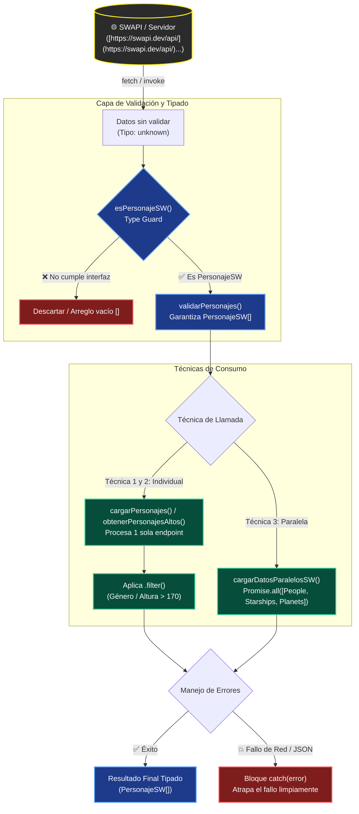

# **Capítulo 00. TypeScript  sobre ES6+/ES2026 📝**💻

- [**Capítulo 00. TypeScript  sobre ES6+/ES2026 📝**💻](#capítulo-00-typescript-sobre-es6es2026)
- [0. Introducción a JavaScript y TypeScript 📖](#0-introducción-a-javascript-y-typescript)
  - [0.1 ¿Qué es TypeScript?](#01-qué-es-typescript)
  - [0.2 Ventajas de TypeScript](#02-ventajas-de-typescript)
  - [0.3 Instalación y Configuración](#03-instalación-y-configuración)
  - [0.4 Características Modernas](#04-características-modernas)
    - [1. **Lenguaje Multi-paradigma Moderno**](#1-lenguaje-multi-paradigma-moderno)
    - [3. **Programación Funcional Avanzada**](#3-programación-funcional-avanzada)
    - [4. **Tipado Estático con TypeScript**](#4-tipado-estático-con-typescript)
    - [6. **Asincronía Nativa y Moderna**](#6-asincronía-nativa-y-moderna)
  - [0.5 Primeros Pasos con TypeScript ](#05-primeros-pasos-con-typescript)
    - [Hola Mundo Moderno](#hola-mundo-moderno)
    - [Arrow Functions](#arrow-functions)
    - [Template Literals](#template-literals)
    - [Destructuring](#destructuring)
  - [0.6 Ejemplo completo-resumen](#06-ejemplo-completo-resumen)
- 🧪 **Ejercicios:** [¿Qué es TypeScript?](../../ejerciciosTS.md#1-que-es-typescript) · [Instalación y Configuración](../../ejerciciosTS.md#2-instalacion-y-configuracion-basica)

---

# 0. Introducción a JavaScript y TypeScript 📖

## 0.1 ¿Qué es TypeScript?

TypeScript es un lenguaje de programación que extiende JavaScript añadiendo:

- **Tipado estático**: Define tipos para variables, parámetros y retornos
- **Interfaces**: Define contratos para objetos
- **Clases mejoradas**: Con modificadores de acceso y más
- **Enum → uniones de tipos**: Este curso reemplaza las enumeraciones (`enum`) por uniones de string literals, compatibles con Node 24 (a partir de Node 22 se introdujo de forma nativa el Type Stripping (la capacidad de ejecutar archivos .ts directamente borrando las anotaciones de tipo). Sin embargo, para que Node pueda ejecutar un archivo .ts sin compilar, la sintaxis de TypeScript debe ser 100% removible. Y los enum no dejan hacer eso.)
- **Genéricos**: Funciones y clases que trabajan con varios tipos
- **Type narrowing**: Refinar el tipo según el flujo del programa

TypeScript fue desarrollado por Microsoft y se ha convertido en el estándar para desarrollo JavaScript a gran escala. Todo código JavaScript válido es TypeScript válido, pero TypeScript extiende JS con un sistema de tipos que permite detectar errores en tiempo de compilación.

> 💡 **Recuerda:** TypeScript **es** JavaScript con tipos. Todo lo que aprendes de JS se mantiene; los tipos se añaden encima.

## 0.2 Ventajas de TypeScript

1. **Detección temprana de errores**: Los errores se detectan en tiempo de compilación
2. **Mejor autocompletado**: Los IDEs ofrecen mejor soporte
3. **Documentación viva**: Los tipos sirven como documentación
4. **Refactorización más segura**: Los cambios se propagan correctamente
5. **Mejor colaboración**: El código es más explícito y claro
6. **Ecosistema**: React (oficial) parte de TypeScript

Ahora que sabes qué es TypeScript y por qué usarlo, veamos cómo instalarlo y configurarlo.

## 0.3 Instalación y Configuración

Para empezar con TypeScript en **bash** (WSL, Linux o macOS), ejecuta estas 4 órdenes en orden (unas dependen de otras):

```bash
#Creamos una carpeta en tu home (Windows/Linux) y entramos. Entramos en el terminal o usamos el terminal de VSCode. 

# 1. Inicializar el proyecto (crea package.json)
npm init -y

# 2. Instalar TypeScript y tipos de React solo en desarrollo (-D). Crea node_modules con TS y sus tipos.
npm install -D typescript @types/react @types/react-dom

# 3. Crea el archivo de configuración tsconfig.json (reglas de compilación de TypeScript)
npx tsc --init

# 4. Instala o verifica las dependencias leyendo package.json
npm install

```

> [!NOTE]
> En **PowerShell/CMD de Windows** estos comandos bash no funcionan tal cual (el `#` de comentario da error): sigue la instalación de tu SO en [**sesion01**](../../sesion01.md) o usa WSL/Git Bash. Y recuerda: los `npm install` anteriores **crean automáticamente el `package.json`** si no existe (registrando TS en `devDependencies`); el `npx tsc --init` **no** lo toca, crea `tsconfig.json`. La instalación canónica del curso (con `npm init`, `nvm`, scripts y `tsconfig` completo) está en el apunte [**10 · Node.js, npm y Vite en TypeScript**](../s03/10_NPM.md).

### Hola Mundo

Abrimos una carpeta con VSCode. Creamos un fichero (por ejemplo, en vscode poniendo code saludo.ts ) y lo guardamos:

```typescript
console.log("Hola Mundo");
```

### ¿Cómo usar TypeScript?

**Compilar / ejecutar TypeScript en este curso:**

```bash
# 5. Compila todos los .ts a .js según tsconfig.json (transpila todo el proyecto
npx tsc

# 6. Ejecutar un ejemplo copiado de los apuntes (tsx ex TypeScript Execute: ejecuta .ts sin recompilar).
# Copia el bloque "Ejemplo completo" a bancop/<nombre-del-apunte>.ts (p. ej. 00_Introduccion.ts) y ejecuta desde bancop/:
npx tsx saludo.ts

# En el navegador, cuando lancemos Vite, los cambios se reflejan en caliente (HMR)
```

TypeScript se compila a JavaScript estándar, por lo que puede ejecutarse en cualquier navegador o entorno Node.js.

> 🧪 **Banco de pruebas (`bancop/`):** además del Playground oficial, la raíz del curso incluye la carpeta [`bancop/`](../../../bancop/) para **probar cualquier trozo de código suelto** sin crear un proyecto. Copia o escribe tu `.ts`/`.tsx` allí y ejecútalo con `npx tsx fichero.ts` desde `bancop/`. Su `tsconfig.json` ya trae el entorno estricto del curso (`strict`, `noUncheckedIndexedAccess`, `lib: ES2024 + DOM`, `jsx: react-jsx`) y su `package.json` declara `"type": "module"`, por lo que cada fichero se trata como un módulo ES.

> [!NOTE]
> **Erasable-only:** en todo este repositorio usamos solo sintaxis TS que Node 24 puede quitar al ejecutar. Eso significa: sin `enum`, sin `namespace` y sin *parameter properties* en constructores. Interfaces, uniones, tipos y genéricos sí están permitidos. Node no compila TypeScript; simplemente borra los tipos (type stripping) como si pasara un borrador sobre el texto y luego ejecuta el JavaScript que queda.

---

## 0.4 Características Modernas

JavaScript en 2026 es un lenguaje moderno, potente y versátil. Así es JavaScript hoy en día:

#### 1. **Lenguaje Multi-paradigma Moderno**

JavaScript ha evolucionado para soportar múltiples paradigmas de programación:

- **Programación Funcional**: Con arrow functions, inmutabilidad y funciones puras 
- ~~**Programación Orientada a Objetos**: Con clases ES6 (y clases tipadas en TS), herencia y encapsulación~~ (no vamos a ver nada de esto)
- **Programación Asíncrona**: Con async/await, promises y streams
- **Programación Reactiva**: Con observables y patrones modernos

```typescript
// Ejemplo de programación funcional moderna y tipada. Gestión de Items
interface Item {
  nombre: string,
  activo: boolean;
  procesado?: boolean;
}

let lista : Item[] =[{nombre:"ps5", activo:true},{nombre:"xbox", activo:false}]

const procesarDatos = (datos: Item[]): Item[] =>
  datos
    .filter((item) => item.activo)
    .map((item) => ({ ...item, procesado: true }))
    
console.log("Items activos y procesados:");      
for ( const i of procesarDatos(lista) ){
    console.log(i.nombre);
}   

    
// Ejemplo de programación funcional moderna y tipada. Obtención datos API StarWars
interface DatosPost {
  name: string;
}

async function obtenerDatosDesdeAPI(): Promise<void> {
  try {
    const response = await fetch(
      "https://swapi.info/api/people/1",
    );
    if (!response.ok) {
      throw new Error("No se pudo obtener los datos");
    }

    const datos = (await response.json()) as DatosPost;
    console.log("Datos desde la API:", datos.name);
  } catch (error) {
    console.error("Error:", error);
  }
}

obtenerDatosDesdeAPI();

```

> 💡 **¿Cómo haríamos para...?** el mismo patrón de promesas en un proyecto 100% Tauri? El `fetch` a una URL web se sustituirá por `invoke("comando", { id: userId })`, donde el backend es código Rust en lugar de un servidor HTTP. El control de flujo (`async`/`await`, `try/catch`, `Promise`) es idéntico; solo cambia qué función llamamos. De todas formas, lo normal será seguir usando fetch de TS y dejar para Tauri puro solamente lo indispensable.

#### 3. **Programación Funcional Avanzada**

JavaScript ES6+ ofrece características poderosas para programación funcional:

```typescript
// Array methods funcionales con tipos (para tratamiento de datos en React)
const numeros: number[] = [1, 2, 3, 4, 5];
const resultado: number = numeros
  .filter((n) => n % 2 === 0)
  .map((n) => n * 2)
  .reduce((acc, n) => acc + n, 0);
  
console.log(resultado);//12  

// Funciones como ciudadanos de primera clase (first-class citizens). 
// Usaremos este concepto para entender los eventos dinámicos en React. 
// FCC: las funciones se tratan exactamente 
// igual que cualquier otro valor (como un número, un texto o un booleano).
// Puedes guardar una función en una variable, pasarla como argumento a otra función o hacer que una 
// función devuelva otra función.
type Operador = "+" | "-" | "*";

const crearOperacion = (operador: Operador) =>
  (a: number, b: number): number => {
    switch (operador) {
      case "+":
        return a + b;
      case "-":
        return a - b;
      case "*":
        return a * b;
      default:
        return 0;
    }
  };

const sumar = crearOperacion("+"); //la variable sumar es una función en sí
const multiplicar = crearOperacion("*");//la variable multiplicar es una función en sí
```

#### 4. **Tipado Estático con TypeScript**

JavaScript mantiene su tipado dinámico, pero este curso, y la mayoría de la industria moderna, apuesta por **TypeScript** para el tipado estático:

```typescript
// JavaScript: tipado dinámico (permitido, pero no recomendado en este curso)
let variable: unknown = 42;        // se puede cambiar el tipo en runtime
variable = "Hola";
variable = [1, 2, 3];
variable = { nombre: "Profe" };

// TypeScript: tipado estático seguro
let numero: number = 42;
let texto: string = "Profe";
interface Usuario {
  nombre: string;
  edad: number;
}
let usuario: Usuario = {
  nombre: "Profe",
  edad: 35,
};
```

> [!IMPORTANT]
> En este curso **prohibimos `any`** en los ejemplos. Por qué? El uso de any INVALIDA las ventajas de TS. Cuando un valor llega del exterior y no conocemos su tipo (p. ej. `JSON.parse`), lo tratamos como `unknown` y lo validamos mediante narrowing (typeof/instanceof/type guards). Veremos el patrón en los capítulos de localStorage y Fetch API.

#### 6. **Asincronía Nativa y Moderna**

JavaScript es conocido por su enfoque **asíncrono** y su capacidad para manejar operaciones basadas en eventos, como las interacciones del usuario o las solicitudes HTTP. Este enfoque es especialmente importante en entornos como los **navegadores** y **Node.js**, donde ciertas operaciones, como la **carga de datos desde un servidor, pueden tardar un tiempo en completarse**.

**El modelo de eventos** permite a JavaScript responder a acciones como clics de usuario, movimientos del ratón o el envío de formularios. Este comportamiento basado en eventos garantiza que JavaScript no detenga el flujo de ejecución mientras espera que ciertas operaciones finalicen, lo que resulta en una mejor **experiencia de usuario** y una mayor **eficiencia**.

**Conceptos fundamentales de la asincronía en JavaScript:**

- **Single Thread**: JavaScript ejecuta código en un solo hilo principal
- **Event Loop**: Mecanismo que gestiona la ejecución de tareas asíncronas
- **Non-blocking**: Las operaciones asíncronas no bloquean el hilo principal
- **Callback Queue**: Cola donde se almacenan las funciones callback pendientes

**Evolución de la asincronía en JavaScript:**

1. **Callbacks (1995)**: El método original para manejar asincronía
2. **Promises (2015)**: ES6 introdujo las promesas para mejorar la gestión asíncrona
3. **Async/Await (2017)**: ES8 proporcionó una sintaxis más clara para trabajar con promesas
4. **Top-level await (2022)**: Permitido usar `await` fuera de funciones async (es otra forma distinta a la que vamos a ver porque se usa para resolver datos antes de que la APP se inicie Ejemplo: un módulo que detecta el idioma del navegador y descarga el archivo JSON de idioma correspondiente antes de exportar la instancia de traducción)

**Ejemplos prácticos de asincronía moderna (y tipada):**

```typescript
//Ejemplo: Acceso a una API 
// 1. Adaptamos la interfaz al tipo de dato que devuelve SWAPI para un personaje
interface PersonajeSW {
  name: string;
  height: string;
  gender: string;
}

// Interfaz utilitaria para la respuesta paginada de SWAPI
interface SWAPIResponse {
  results: unknown[];
}

// Type guard: valida desde `unknown` que el objeto cumpla la forma de PersonajeSW. Devuelve booleano
function esPersonajeSW(valor: unknown): valor is PersonajeSW {
  if (typeof valor !== "object" || valor === null) return false;
  const v = valor as Record<string, unknown>;
  return (
    typeof v.name === "string" &&
    typeof v.height === "string" &&
    typeof v.gender === "string"
  );
}

// Filtra y valida un arreglo de elementos desconocidos
function validarPersonajes(valor: unknown): PersonajeSW[] {
  if (typeof valor !== "object" || valor === null) return [];
  const respuesta = valor as Partial<SWAPIResponse>;
  
  return (Array.isArray(respuesta.results) ? respuesta.results : []).filter(esPersonajeSW);
}

// 1. Promesas con Fetch directo a SWAPI
async function cargarPersonajes(): Promise<PersonajeSW[]> {
  console.log("Iniciando carga de personajes de Star Wars...");
  const response = await fetch("https://swapi.dev/api/people/");
  const bruto: unknown = await response.json();
  const personajes = validarPersonajes(bruto);
  
  // Filtramos, por ejemplo, personajes femeninos en lugar de "activos"
  const personajesFemeninos = personajes.filter((p) => p.gender === "female");
  console.log("Personajes femeninos:", personajesFemeninos);
  return personajesFemeninos;
}

// 2. Async/Await con control de errores
async function obtenerPersonajesAltos(): Promise<PersonajeSW[]> {
  try {
    console.log("Buscando personajes de más de 170cm...");
    const response: Response = await fetch("https://swapi.dev/api/people/");
    const bruto: unknown = await response.json();
    const personajes: PersonajeSW[] = validarPersonajes(bruto);
    
    // Filtramos personajes con altura mayor a 170cm
    const personajesAltos = personajes.filter((p) => parseInt(p.height) > 170);

    console.log(`Se encontraron ${personajesAltos.length} personajes altos.`);
    return personajesAltos;
  } catch (error: unknown) {
    console.error("Error al obtener personajes de SWAPI:", error);
    throw error;
  }
}

// 3. Promise.all consultando múltiples endpoints reales en paralelo
async function cargarDatosParalelosSW(): Promise<void> {
  console.log("Cargando datos de Star Wars en paralelo...");
  try {
    const [personajesRaw, navesRaw, planetasRaw] = await Promise.all([
      fetch("https://swapi.dev/api/people/").then((r) => r.json() as Promise<unknown>),
      fetch("https://swapi.dev/api/starships/").then((r) => r.json() as Promise<unknown>),
      fetch("https://swapi.dev/api/planets/").then((r) => r.json() as Promise<unknown>),
    ]);

    console.log("Respuesta Personajes:", personajesRaw);
    console.log("Respuesta Naves:", navesRaw);
    console.log("Respuesta Planetas:", planetasRaw);
  } catch (error: unknown) {
    console.error("Error en carga paralela de SWAPI:", error);
  }
}

//En Debug Console no vemos el JSON resultante
cargarDatosParalelosSW();
//npx tsx cargarDatosParalelosSW.ts
```
> 💡 **¿Cómo haríamos para...?** ejecutar estas tres llamadas en paralelo en Tauri? Con `Promise.all([invoke("listar_personajes"), invoke("listar_naves"), invoke("listar_planetas")])`. El patrón de promesas paralelas es el mismo; solo cambia que cada `fetch` se convierte en un `invoke` hacia Rust.




**Ventajas de la asincronía moderna:**

- **Mejor rendimiento**: No bloquea la interfaz de usuario
- **Código más legible**: Async/await se lee como código síncrono
- **Mejor manejo de errores**: Try/catch funciona con código asíncrono y `error` es `unknown` (se estrecha)
- **Composición**: Las promesas se pueden combinar y encadenar fácilmente

El enfoque asíncrono de JavaScript permite que el programa continúe ejecutándose mientras espera por operaciones más lentas, como una solicitud de red o la lectura de archivos. Esto mejora significativamente el rendimiento en aplicaciones interactivas, evitando que la interfaz de usuario se "congele" mientras espera respuestas del servidor.

> [!NOTE]
> En TypeScript, una función `async` siempre devuelve `Promise<T>`. El tipo `T` se infiere del `return`. Además, en lugar de `any` para los datos de la API, usaremos *type guards* y validación.

## 0.5 Primeros Pasos con TypeScript

Además de React, TypeScript sirve para construir backends robustos y tipados en Node.js o NestJS, aplicaciones móviles con React Native o Expo, programas de escritorio multiplataforma mediante Electron, apps web con frameworks como Angular o Vue, y funciones en la nube (serverless); en todos estos entornos aporta autocompletado avanzado, prevención de errores en tiempo de compilación y mayor facilidad para mantener y escalar código en proyectos grandes.

Vamos a crear nuestros primeros ejemplos utilizando TypeScript  sobre la base de JavaScript ES6+. Estos son los conceptos fundamentales que necesitarás para empezar a programar. Podemos probar gran parte del código en el Playground oficial de TS en https://www.typescriptlang.org/play/ o en el BANCO DE PRUEBAS de este proyecto.

### Hola Mundo Moderno

El clásico "Hola Mundo" pero con características modernas:

```typescript
// Hola Mundo con template literals y tipos
const profesor: string = "Profe";
const modulo: string = "DI";
const mensaje: string = `¡Hola! Soy ${profesor} y te doy la bienvenida a ${modulo}`;

console.log(mensaje); // ¡Hola! Soy Profe y te doy la bienvenida a DI

```

### Arrow Functions

Las funciones flecha son una forma más compacta de escribir funciones, y en TypeScript se tipan:

```typescript
// Función tradicional tipada
function saludarTradicional(nombre: string): string {
  return `Hola, ${nombre}`; //esta construcción se llama template literal, ahora después se desarrolla
}

// Arrow function básica (usa const y se asigna a nombre de función). De forma GENERAL usaremos esta
const saludarFlecha = (nombre: string): string => {
  return `Hola, ${nombre}`;
};

// Arrow function más concisa (si solo tiene un parámetro, nos ahorramos las llaves)
const saludarConcisa = (nombre: string): string => `Hola, ${nombre}`;

// Arrow function sin parámetros
const saludarProfesor = (): string => "Hola, soy el Profe";

// Ejemplos de uso
console.log(saludarTradicional("María"));
console.log(saludarFlecha("Juan"));
console.log(saludarConcisa("Ana"));
console.log(saludarProfesor());

// Arrow functions con múltiples parámetros
const calcularMedia = (nota1: number, nota2: number, nota3: number): string => {
  let media: number = (nota1 + nota2 + nota3) / 3;
  return `La media de ${nota1}, ${nota2} y ${nota3} es: ${media.toFixed(2)}`;
};

console.log(calcularMedia(7.5, 8.0, 6.5));
```

### Template Literals

Los template literals permiten crear cadenas de texto con variables y expresiones:

```typescript
const profesor: string = "Profe";
const asignatura: string = "TypeScript";
const nivel: string = "Básico";

// Template literal multilínea
const descripcion: string = `
Curso: ${asignatura}
Profesor: ${profesor}
Nivel: ${nivel}
Duración: 120 horas
`;

console.log(descripcion);

// Template literals con expresiones
const precioBase: number = 100;
const descuento: number = 0.15;
const precioFinal: number = precioBase * (1 - descuento);

const mensaje: string = `
${profesor} - ${asignatura}
----------------------------------------
Precio base: €${precioBase}
Descuento: ${descuento * 100}%
Precio final: €${precioFinal.toFixed(2)}
¡Ahorras: €${(precioBase * descuento).toFixed(2)}!
`;

console.log(mensaje);

// Template literals con funciones
const formatearNombre = (nombre: string, apellidos: string): string => {
  const nombreCompleto: string = `${nombre} ${apellidos}`.toUpperCase();
  return `ALUMNO: ${nombreCompleto}`;
};

console.log(formatearNombre("juan", "pérez")); // ALUMNO: JUAN PÉREZ
```

### Destructuring

El destructuring permite extraer valores de arrays y objetos de forma concisa, y en TypeScript mantiene los tipos. Muy útil en React para los Props y Hooks. Para entendernos, los Props son los canales de comunicación de datos de entrada que pasamos a un componente (ej: caja de texto) y los Hooks (estado) es el almacén de datos..

Se usa sobre todo en React en la recepción de Props (ejemplo D), en la firma de las funciones (cabecera) para no tener que estar accediendo a objeto.propiedad1, objeto.propiedad2, etc.

```typescript
// A - Destructuring de arrays
const tecnologias: string[] = ["JavaScript", "TypeScript", "React", "Node.js", "Tauri"];
const [js, ts, react, node, tauri] = tecnologias;

console.log(`Frontend: ${js} y ${react}`);
console.log(`Backend: ${node} y ${tauri}`);
console.log(`Tipado: ${ts}`);

// B - Destructuring de objetos (el tipo se declara con interface)
// Un interface es propio de TS: define la estructura y el tipo de datos que debe tener un objeto. 
// Es extremadamente útil y se usa mucho.
interface ProfesorInfo {
  nombre: string;
  apellidos: string;
  modulo: string;
  experiencia: number;
  especialidades: string[];
}

//Declaramos un "objeto" interface
const profesorInfo: ProfesorInfo = {
  nombre: "Profe",
  apellidos: "MC",
  modulo: "DI",
  experiencia: 20,
  especialidades: ["Java", "TypeScript", "React", "Unity"],
};

// He de llamar de la misma forma a las variables que devuelve 
const { nombre, apellidos, modulo, experiencia } = profesorInfo;
console.log(`Profesor: ${nombre} ${apellidos}`);
console.log(`Módulo: ${modulo}`);
console.log(`Experiencia: ${experiencia} años`);

// C - Destructuring con valores por defecto
interface Configuracion {
  tema: string;
  idioma: string;
  tamanoFuente?: string; // ? indica opcionalidad en la inicialización
}

const configuracion: Configuracion = {
  tema: "oscuro",
  idioma: "español",
};

const { tema, idioma, tamanoFuente = "mediana" } = configuracion;
console.log(`Tema: ${tema}, Idioma: ${idioma}, Fuente: ${tamanoFuente}`);

// D - Destructuring en parámetros de funciones (el tipo se define como interface)
interface AlumnoInfo {
  nombre: string;
  edad: number;
  curso?: string;
}

const mostrarInfoAlumno = ({ nombre, edad, curso = "DI" }: AlumnoInfo): string => {
  return `Alumno: ${nombre}, Edad: ${edad}, Curso: ${curso}`;
};

const alumno1: AlumnoInfo = { nombre: "Ana", edad: 20 };
const alumno2: AlumnoInfo = { nombre: "Carlos", edad: 21, curso: "DAM" };

console.log(mostrarInfoAlumno(alumno1)); // Curso: DI (por defecto)
console.log(mostrarInfoAlumno(alumno2)); // Curso: DAM
```

### Otro ejemplo de  código con mezcla de conceptos con TypeScript

Aquí ya vemos muchos conceptos mezclados y alguno que aún no se ha visto (como las uniones y los genéricos):

```typescript
// TypeScript: Variables tipadas
let nombre: string = "Profe";
let edad: number = 35;
let esProfesor: boolean = true;
let tecnologias: string[] = ["JavaScript", "TypeScript", "React"];

//interface+inicialización
interface Info {
  nombre: string;
  edad: number;
}
let info: Info = {
  nombre: "Profe",
  edad: 35,
};

// TypeScript: Funciones tipadas
function saludar(nombre: string): string {
  return `Hola, ${nombre}`;
}

function calcularMedia(notas: number[]): number {
  const suma = notas.reduce((acc, nota) => acc + nota, 0);
  return suma / notas.length;
}

// TypeScript: Interfaces y uniones
interface Alumno {
  nombre: string;
  edad: number;
  curso?: string; // ? significa opcional
}

interface Profesor {
  nombre: string;
  especialidades: string[];
  experiencia: number;
}

function mostrarInfoPersona(persona: Alumno | Profesor): void {
  console.log(`Nombre: ${persona.nombre}`);

  if ("experiencia" in persona) {
    console.log(`Experiencia: ${persona.experiencia} años`);
  } else if ("curso" in persona) {
    console.log(`Curso: ${persona.curso || "No asignado"}`);
  }
}

// Uso de las interfaces
const alumno: Alumno = {
  nombre: "Ana García",
  edad: 20,
  curso: "DI",
};

const profesor: Profesor = {
  nombre: "Profe",
  especialidades: ["JavaScript", "TypeScript"],
  experiencia: 10,
};

mostrarInfoPersona(alumno);
mostrarInfoPersona(profesor);

// TypeScript: Genéricos
function crearArray<T>(items: T[]): T[] {
  return new Array<T>().concat(items);
}

const numeros: number[] = crearArray([1, 2, 3]);
const textos: string[] = crearArray(["a", "b", "c"]);

console.log(numeros); // [1, 2, 3]
console.log(textos); // ["a", "b", "c"]
```


---

## 0.6 Ejemplo completo-resumen 

```typescript
export {};

/**
 * Que es TypeScript
 * -------------------------------------------
 * TypeScript es un superconjunto de JavaScript que añade
 * tipado estatico opcional. Todo codigo JavaScript valido
 * es TypeScript valido, pero TypeScript extiende JS con un
 * sistema de tipos que permite detectar errores en tiempo
 * de compilacion.
 *
 * - JavaScript detecta errores solo en tiempo de ejecucion
 * - TypeScript detecta errores al escribir (compilacion)
 * - TypeScript compila a JavaScript plano (navegador no lo entiende directamente)
 *
 * - Problemas de JS sin tipos
 * - Solucion con TS tipado
 */

// ========================================
// PROBLEMAS QUE SOLUCIONA TYPESCRIPT
// ========================================

// JavaScript: errores silenciosos en tiempo de ejecucion
function sumarJS(a: any, b: any): any {
    return a + b;
}

console.log("=== JavaScript (con any) ===");
console.log(sumarJS(5, "3"));          // "53" (concatenacion, no suma)
console.log(sumarJS([], {}));          // "[object Object]" (sin sentido)
//La siguiente línea es errónea, pero VSCode no se detiene porque usa tsx
//en vez de npx tsc, de ahí que informe pero sigue porque elimina tipos y crea un .js válido.
console.log(sumarJS(5));               // NaN (falta el segundo argumento)

// // Esto es una función TIPADA escrita en TypeScript: detecta estos errores al escribir
function sumarTS(a: number, b: number): number {
    return a + b;
}

console.log("\n=== TypeScript (tipado) ===");
console.log(sumarTS(5, 3));// 8 - correcto
sumarTS(5, "3");  // Error: Argument of type 'string' not assignable to 'number'
sumarTS(5);       // Error: Expected 2 arguments, but got 1

// ========================================
// DIFERENCIAS CLAVE
// ========================================

// JS: el tipo puede cambiar durante la ejecucion. Esto en .JS no daría error
// pero estamos en un .ts
let mutable = 42;
mutable = "ahora soy string";  // OK en JS, problema silencioso
console.log(mutable);  

// TS: detecta el conflicto de tipos
let tipado: number = 42;
tipado = "hola";  // Error: Type 'string' is not assignable to type 'number'
console.log(tipado);

// JS: no sabe que propiedad existe
const usuario = { nombre: "Ana", edad: 25 };
console.log(usuario.telefono);  // undefined (sin error)

// TS: valida propiedades en tiempo de compilacion
interface Usuario {
    nombre: string;
    edad: number;
}
const usuarioTS: Usuario = { nombre: "Ana", edad: 25 };
console.log(usuarioTS.telefono);  // Error: Property 'telefono' does not exist

// ========================================
// VENTAJAS DE TYPESCRIPT
// ========================================
console.log("\n=== Resumen ===");
console.log("TypeScript = JavaScript + Tipos estaticos");
console.log("Detecta errores al escribir, no al ejecutar");
console.log("Compila a JS plano que el navegador entiende");
```

COMPROBACIÓN FINAL - DIFERENCIA TS/JS

```bash
1-Guardar el anterior bloque de código como saludo.ts
2-Si ejecutamos con VSCODE parece que no detecta errores de forma normal (resultado en Debug Console). 
Lo que está pasando es que lo está lanzando internamente con tsx: elimina tipos y genera el .js en memoria. 
TSX EJECUTA y NO hace comprobaciones de tipos ni en tiempo de compilación ni de ejecución.
3-Obtenemos el mismo resultado que si lanzamos con: npx tsx saludo.ts
4-Pero, si COMPILAMOS diciendo que no genere el .js, entonces SÍ marca los errores. Probamos:
  npx tsc saludo.ts --noEmitOnError --ignoreConfig  //Compila un fichero (y no todo el proyecto). Además, con noEmitOnError: No compila si encuentra error
6-npx tsc saludo.ts --ignoreConfig  //Compila un fichero (y no todo el proyecto) 
sin noEmitOnError: Me deja pasar y genera el .js
7-Ahora comparamos ambos ficheros .js y .ts ¿qué diferencias ves? ¿las entiendes?
```

---

> ▶ **Cómo probarlo:** copia este bloque a `bancop` como `00_Introduccion.ts` y ejecuta `npx tsx 00_Introduccion.ts` (desde `bancop/`; entorno estricto + lib ES2024 ya en su tsconfig).


---

[Volver al índice general](../../../README.md#5-distribución-temporal-y-contenidos-s00s13)
