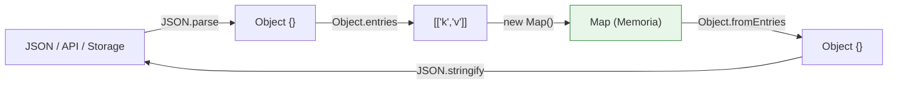

<a id="06-estructuras-de-datos-arrays-en-typescript"></a>
# 06. Estructuras de Datos. Arrays en TypeScript 📝\*\* 🖥️

- [07. Estructuras de Datos. Arrays en TypeScript 📝\*\* 🖥️](#06-estructuras-de-datos-arrays-en-typescript)
  - [6.1 Introducción](#61-introducción)
  - [6.2 La Importancia de la Inmutabilidad](#62-la-importancia-de-la-inmutabilidad)
  - [6.3 Creación de Arrays](#63-creación-de-arrays)
    - [6.3.1 Arrays Literales](#631-arrays-literales)
  - [6.3.2 Modificación de Elementos](#632-modificación-de-elementos)
  - [6.4 Métodos Importantes de Arrays](#64-métodos-importantes-de-arrays)
    - [i. `push()` y `pop()`](#i-push-y-pop)
    - [ii. `Slice()`](#ii-slice)
    - [iii. `map()`](#iii-map)
    - [iv. `filter()`](#iv-filter)
    - [v. `reduce()`](#v-reduce)
    - [vi. `sort()`](#vi-sort)
    - [vii. Métodos inmutables](#vii-métodos-inmutables)
  - [6.5 Arrays Multidimensionales](#65-arrays-multidimensionales)
  - [6.6 Metodos que modifican o no el Array original](#66-metodos-que-modifican-o-no-el-array-original)
    - [6.6.1 Modificar el Array Original](#661-modificar-el-array-original)
    - [6.6.2 Crear una Copia](#662-crear-una-copia)
  - [6.7 Recorrer Arrays en TypeScript](#67-recorrer-arrays-en-typescript)
    - [6.7.1 Usando `for...of`](#671-usando-forof)
    - [6.7.2 Método `forEach`](#672-método-foreach)
  - [6.8 Clonar un Array](#68-clonar-un-array)
  - [6.9 Destructuring con Arrays](#69-destructuring-con-arrays)
    - [a. Destructuring Básico](#a-destructuring-básico)
    - [b. Asignación por Defecto](#b-asignación-por-defecto)
    - [c. Destructuring Anidado](#c-destructuring-anidado)
    - [d. Rest Parameters](#d-rest-parameters)
  - [6.10 Tipado de arrays: tipos y genéricos](#610-tipado-de-arrays-tipos-y-genéricos)
  - [6.11 `Map`: el diccionario clave-valor](#611-map-el-diccionario-clave-valor)
  - [6.12 `Set`: conjunto de valores únicos](#612-set-conjunto-de-valores-únicos)
  - [6.13 ¿Cuándo usar Array y cuándo Map/Set?](#613-cuándo-usar-array-y-cuándo-mapset)
- 🧪 **Ejercicios:** [Arrays y Tuplas](../../../ejerciciosTS/ejerciciosTS.md#14-arrays-y-tuplas) · [Arrays: métodos fundamentales](../../../ejerciciosTS/ejerciciosTS.md#15-arrays-métodos-fundamentales) · [Set](../../../ejerciciosTS/ejerciciosTS.md#16-set-conjunto-de-valores-únicos) · [Map](../../../ejerciciosTS/ejerciciosTS.md#17-map-diccionario-clave-valor)

---

<a id="61-introducción"></a>
## 6.1 Introducción

Los arrays son una de las estructuras de datos fundamentales en JavaScript/TypeScript. Permiten almacenar y organizar colecciones de elementos de manera ordenada. Serán fundamentales cuando estemos trabajando con datos en React.


En este documento, exploraremos en profundidad cómo trabajar con arrays en TypeScript, donde además de los métodos de ES6+ contamos con `T[]` o `Array<T>` (estas anteriores son equivalentes), `readonly` y tuplas.

<a id="62-la-importancia-de-la-inmutabilidad"></a>
## 6.2 La Importancia de la Inmutabilidad

Antes de ver los métodos, una regla que marcará cómo uses los arrays en React: **no modifiques el array original, no  lo toques, no se te ocurre cambiarlo, CACA!!! 💩 Crea uno nuevo**. 

¿Por qué no mutar?** React decide si re-renderizar la pantalla comparando **referencias** (dirección de memoria). Comparar dos arrays con `===` y solo comprueba si apuntan al mismo lugar en memoria, no su contenido:

- Si **mutas** (`push`, `splice`, `arr[0] = …`): `arrayOriginal === arrayModificado` → `true` → React cree que nada cambió y **no re-renderiza**.❌
- Si **creas uno nuevo** (spread, `map`, `filter`…): `arrayOriginal === arrayNuevo` → `false` → React detecta el cambio y **actualiza la pantalla**.✅

**Demostración** (simulando el chequeo interno de React):

❌ **Mutación** — React ignora el cambio:

```typescript
let listaActual: string[] = ["Manzana", "Banana"];
const referenciaGuardada = listaActual; // la referencia que "guarda" React

listaActual.push("Naranja"); // ❌ modifica el array en su misma dirección de memoria

if (referenciaGuardada === listaActual) {
  console.log("React: 'Es el mismo array en memoria. NADA CAMBIÓ, NO RE-RENDERIZO.'");
}
console.log(listaActual); // ["Manzana", "Banana", "Naranja"] (cambió, pero nadie lo detectó)
```

✅ **Crear un array nuevo** — React detecta el cambio:

```typescript
let listaActual: string[] = ["Manzana", "Banana"];
const referenciaGuardada = listaActual;

const nuevaLista: string[] = [...listaActual, "Naranja"]; // ✅ array nuevo, nueva dirección

if (referenciaGuardada === nuevaLista) {
  console.log("React: 'Es el mismo array en memoria. NADA CAMBIÓ.'");
} else {
  console.log("React: 'Es un array nuevo en memoria. ¡ACTUALIZO LA PANTALLA!'");
}
```

**Guía rápida de métodos:**

| Operación | ❌ Mutan el original (evitar) | ✅ Devuelven un array nuevo (usar) |
|---|---|---|
| Añadir elemento | `array.push("x")` | `[...array, "x"]` |
| Eliminar elemento | `array.splice(indice, 1)` | `array.filter(item => …)` |
| Modificar elemento | `array[0] = "nuevo"` | `array.map(item => …)` |
| Ordenar | `array.sort()` | `array.toSorted()` |

>💡 **Resumen en una frase:** 
> mutar → `viejoArray === nuevoArray` es `true` → React ignora el cambio; 
 

>💡 **Resumen en una frase:** 
>crear una copia → `false` → React detecta el cambio.

<a id="63-creación-de-arrays"></a>
## 6.3 Creación de Arrays

<a id="631-arrays-literales"></a>
### 6.3.1 Arrays Literales

Puedes crear un array literalmente encerrando elementos entre corchetes `[]` y separándolos por comas (o usar la forma genérica). En TypeScript se anota el tipo de los elementos:

```typescript
const frutas: Array<string> = ["manzana", "plátano", "naranja"];
const frutas: string[] = ["manzana", "plátano", "naranja"];//se prefiere esta por ser más corta
```

<a id="632-modificación-de-elementos"></a>
### 6.3.2 Modificación de Elementos

Puedes modificar elementos en un array asignando un nuevo valor a través de su **índice**.

```typescript
frutas[1] = "pera"; // Modificar la segunda fruta (plátano a pera)
```

<a id="64-métodos-importantes-de-arrays"></a>
## 6.4 Métodos Importantes de Arrays

<a id="i-push-y-pop"></a>
### i. `push()` y `pop()`

- `push(elemento)`: Agrega un elemento al final del array.
- `pop()`: Elimina el último elemento del array y lo retorna. Es bueno marcar undefined porque podría estar vacío.

```typescript
//Ejemplo 1
const numeros: number[] = [1, 2, 3];
numeros.push(4); // [1, 2, 3, 4]
const ultimo: number | undefined = numeros.pop(); //Pop MUTA! 
console.log(numeros);//numeros = [1, 2, 3] 
console.log(ultimo);//ultimo=4
```

<a id="ii-slice"></a>
### ii. `slice()`

El método `slice()` en JavaScript se utiliza para extraer una porción de un array y crear un nuevo array con los elementos seleccionados.
`slice()` toma uno o dos argumentos: el índice de inicio (inclusive) y el índice de fin (excluyente, es decir, no lo tiene en cuenta) de la porción que se desea extraer.

**Sintaxis:**

```typescript
array.slice([índiceInicio[, índiceFin]])
```

- `índiceInicio` (opcional): El índice a partir del cual se comenzará a extraer elementos. Si no se especifica, se usará 0 como índice de inicio.

```typescript
const frutas: string[] = ["manzana", "banana", "cereza", "dátiles", "uva"]//se prefiere esta por ser más corta
// Ejemplo 2: Extraer elementos desde el índice de inicio
const desdeInicio: string[] = frutas.slice(2);
console.log(desdeInicio); // Resultado: ["cereza", "dátiles", "uva"]

const desdeMitad: string[] = frutas.slice(1,2);//El segundo índice es excluyente,
console.log(desdeMitad); // Resultado: ["banana"]

// Ejemplo 3: Copiar un array completo
const copiaFrutas: string[] = frutas.slice(); //SLICE NO MUTA!
console.log(copiaFrutas); // Resultado: ["manzana", "banana", "cereza", "dátiles", "uva"]
```


<a id="iii-map"></a>
### iii. `map()`

`map(función)`: Crea un nuevo array **aplicando una función a cada elemento del array original**. Es una de las funciones **más potentes** que hay sobre arrays. En el callback (los paréntesis) de esta función, podemos utilizar hasta 3 parámetros: el valor de cada elemento, el índice de la iteración, y el array en sí. En TypeScript,  la firma interna es`map<U>(fn: (valor: T, índice: number, array: T[]) => U): U[]` devuelve un array **del tipo que devuelva el callback**.

```typescript
const numeros: number[] = [1, 2, 3];

//1 parámetro en el callback
const duplicados: number[] = numeros.map((numero) => numero * 2); // [2, 4, 6]

//2 parámetros en el callback
const numeros1: number[] = [2, 2, 2];
const numeros2: number[] = [2, 0, -2];
const numerosSumados: number[] = numeros1.map((ele, i) => ele + numeros2[i]!); // [4, 2, 0]
//Con la opción noUncheckedIndexedAccess activa en el tsconfig.json, acceder a un array mediante un índice (numeros2[i]) devuelve el tipo number | undefined. 
//TypeScript no puede garantizar en tiempo de compilación que numeros2 tenga un elemento en la posición i, aunque sepamos que ambos arrays tienen la misma longitud.
//Solución RÁPIDA. Usar non null assertion !

//Solución CORRECTA (solución más limpia). Nullish Coalescing (??)
const numerosSumados2: number[] = numeros1.map((ele, i) => ele + (numeros2[i]?? 0)); // [4, 2, 0]


///3 parámetros en el callback
const multiplicadosPorTotal: number[] = 
numeros.map((n, _indice, numeros) => n * numeros.length); // el _ se pone para
// decirle a TS que NO lo vamos a consumir (no vamos a hacer nada con él) 
// Pero para pasarle el 3º parámetro [el array original] necesitamos poner un 2º parámetro)

console.log(multiplicadosPorTotal); // [3, 6, 9]
```

**Cambio de tipo con map (extracción):**

```typescript
interface Producto {
  nombre: string;
  precio: number;
}

const productos: Producto[] = [
  { nombre: "Camiseta", precio: 15 },
  { nombre: "Pantalón", precio: 30 },
];

const nombres: string[] = productos.map((p) => p.nombre); //Extraemos nombres. Se ha cambiado tipo Producto a string[]
```

<a id="iv-filter"></a>
### iv. `filter()`

`filter(función)`: Crea un **nuevo array con todos los elementos que cumplen una condición** (el callback devuelve `true`), sin modificar el original (método inmutable). Es decir, solo se queda con los elementos que pasan el filtro.

```typescript
const numeros: number[] = [1, 2, 3, 4, 5, 6];
const pares: number[] = numeros.filter((n) => n % 2 === 0); // [2, 4, 6]

//Otro ejemplo con objetos
interface Producto {
  nombre: string;
  precio: number;
  disponible: boolean;
}

let productos: Producto[] = [
{nombre:"pc", precio:100, disponible: true},
{nombre:"cpc", precio:500, disponible: false}]

//Quédate solo con los disponibles
const enStock = productos.filter((p) => p.disponible); //Devuelve mismo tipo
console.log(enStock[0]?.nombre); //Optional Chaining (se verá más adelante)
//Si no lo ponemos, TS avisa de que puede devolver undefined
//Si enStock[0] existe, accede a .nombre; si no existe, 
//devuelve undefined sin lanzar un error en tiempo de ejecución".
```

> [!NOTE]
> `Optional Chaining` se verá en capítulo 07_Estructuras_de_Datos.md.

<a id="v-reduce"></a>
### v. `reduce()`

`reduce(función, valorInicial)`: Aplica una función acumulativa a los elementos del array, retornando un único valor acumulado. La función callback recibe `(acumulador, valorActual, índice, array)`. 
```typescript
const initialValue: number = 0;
const numeros: number[] = [1, 2, 3, 4, 5];
const suma: number = numeros.reduce(
  (acumulador, numero) => acumulador + numero,
  initialValue,
); // 15
```
El `valorInicial` (opcional) se pasa como **segundo argumento a `reduce()`**, no al callback. Si se omite, el primer elemento del array se usa como acumulador inicial y la iteración empieza desde el segundo elemento.

```typescript
const numeros: number[] = [5, 10, 15];
const sumaConInicial: number = numeros.reduce((acumulador, numero) => acumulador + numero, 10); // 40
const sumaSinInicial: number = numeros.reduce((acumulador, numero) => acumulador + numero); // 30
```

> ⚠️ Si llamas a `reduce()` sin valor inicial sobre un **array vacío**, lanza `TypeError`. Usa siempre un valor inicial cuando el array pueda estar vacío. Además, con valor inicial, TypeScript infiere el tipo del acumulador a partir de ese valor: `numeros.reduce((acc, n) => acc + n.toFixed(1), "")` devuelve `string`.

<a id="vi-sort"></a>
### vi. `sort()`

El método `sort()` en JavaScript se utiliza para ordenar los elementos de un array en su lugar (sin crear un nuevo array, MUTA). Por defecto, `sort()` ordena los elementos como cadenas de texto y los compara en orden lexicográfico. Sin embargo, puedes proporcionar una función de comparación personalizada para ordenar elementos de acuerdo a criterios específicos. El valor de retorno de esta función debe ser un número cuyo signo indique el orden relativo de los dos elementos: negativo si a es menor que b, positivo si a es mayor que b, y cero si son iguales.

```typescript
array.sort([comparador]);
```

- `array`: El array que deseas ordenar.
- `comparador` (opcional): Una función `(a: T, b: T) => number` que define el criterio de ordenación personalizado.

```typescript
const numeros: number[] = [4, 2, 9, 1, 5];
numeros.sort((a, b) => a - b); //es decir, el "primero ha de ser menor que el segundo" (ordena ascendentemente)
// si a-b < 0 : a se pone antes que b. si a-b > 0: b se pone antes que a
console.log(numeros); // Resultado: [1, 2, 4, 5, 9]

const numeros: number[] = [4, 2, 9, 1, 5];
numeros.sort((a, b) => b - a); //es decir, el "primero ha de ser mayor que el segundo" (ordena descendentemente)
// si b-a < 0 : a se pone antes que b. si b-a > 0: b se pone antes que a
console.log(numeros); // Resultado: [9, 5, 4, 2, 1]
```

```typescript
const letras: string[] = ["b", "d", "a", "c"];
letras.sort();
letras.sort().reverse(); //Reverse ya es una función preestablecida.
console.log(letras); // Resultado: ["d", "c", "b", "a"]
```

Primero ordenamos las letras alfabéticamente y luego invertimos el orden usando `reverse()` para obtener el orden inverso.

> [!WARNING]
> `sort()` y `reverse()` **modifican el array original (MUTAN)**. En patrones funcionales (y en estado de React) se prefiere `toSorted()` y `toReversed()`, que devuelven copias (ES2023).

<a id="vii-métodos-inmutables"></a>
### vii. Métodos inmutables

`toSorted()`, `toReversed()`, `toSpliced()` y `with()` son versiones que **no modifican el array original**, devolviendo una copia:

```typescript
const original: number[] = [3, 1, 2];

// toSorted() — ordena sin mutar
const ordenado: number[] = original.toSorted(); // [1, 2, 3]
console.log(original);                          // [3, 1, 2] (intacto)

// toReversed() — invierte sin mutar
const invertido: number[] = original.toReversed(); // [2, 1, 3]

// toSpliced(inicio, cuantosBorrar, ...elementosAInsertar)  spliced inmutable
const reemplazado: number[] = original.toSpliced(0, 1, 99); // [99, 1, 2]
const reemplazado2: number[] = original.toSpliced(0, 1, 99, 200, 300); // [99, 200, 300, 1, 2]

// with(index, value) — reemplaza un elemento sin mutar
// Es la vesión inmutable de array[indice]=valor
const cambiado: number[] = original.with(1, 42); // [3, 42, 2]
```

> Estos métodos son preferibles a `sort()`, `reverse()` y `splice()` cuando necesitas preservar el array original (patrón funcional / estado inmutable).

**`join(separador)`** también es inmutable: convierte el array en un **string** uniendo los elementos con el separador indicado (por defecto `","`). No modifica el array:

```typescript
const etiquetas: string[] = ["suspense", "thriller", "2024"];
console.log(etiquetas.join(" · ")); // "suspense · thriller · 2024"
console.log(etiquetas.join());      // "suspense,thriller,2024" (separador por defecto)
```

> 💡 En React lo usarás para construir strings a partir de arrays: badges de etiquetas (pequeños iconitos representando una clasificación[ ejemplo: disponible/no disponible en una tienda virtual]), query strings (`params.join("&")`) o exportar datos en CSV.

<a id="65-arrays-multidimensionales"></a>
## 6.5 Arrays Multidimensionales

Los arrays multidimensionales son arrays que contienen otros arrays como elementos. Pueden utilizarse para representar matrices y estructuras de datos más complejas. En TypeScript se escriben como `number[][]` (array de array de numbers).

```typescript
const matriz: number[][] = [
  [1, 2, 3],
  [4, 5, 6],
  [7, 8, 9],
];
const primerElemento: number | undefined = matriz[0]?.[0]; // 1
```

> [!NOTE]
> Con `noUncheckedIndexedAccess`, `matriz[0]` es `number[] | undefined`. El acceso seguro es `matriz[0]?.[0]` (optional chaining), que devuelve `number | undefined`.

<a id="66-metodos-que-modifican-o-no-el-array-original"></a>
## 6.6 Resumen de métodos que modifican o no el Array original

Aquí están los métodos de arrays que pueden modificar el array original y los que crean una copia:

<a id="661-modificar-el-array-original"></a>
### 6.6.1 Modificar el Array Original❌(evitar cara a React)

1. `push(elemento)`: Agrega un elemento al final del array. Modifica el array original al agregar un nuevo elemento al final.

2. `pop()`: Elimina el último elemento del array y lo retorna. Modifica el array original al eliminar un elemento.

3. `forEach(función)`: Ejecuta una función en cada elemento del array sin crear un nuevo array. No crea una copia; en su lugar, permite realizar modificaciones en el lugar.

4. `sort([comparador])`: Ordena los elementos de un array, modificando dicho array y aplicando el comparador para establecer el orden.

<a id="662-crear-una-copia"></a>
### 6.6.2 Crear una Copia✅

1. `map(función)`: Crea un nuevo array aplicando una función a cada elemento del array original sin modificar el array original. `map` crea una copia transformada.

2. `filter(función)`: Crea un nuevo array con todos los elementos que cumplan una condición dada por la función sin modificar el array original. `filter` crea una copia filtrada.

3. `reduce(función, valorInicial)`: Aplica una función acumulativa a los elementos del array, retornando un único valor acumulado sin modificar el array original. No crea una copia, sino que produce un resultado acumulado.

4. `toSorted()`, `toReversed()`, `toSpliced()` y `with()` (ES2023): devuelven copias sin tocar el original.

<a id="67-recorrer-arrays-en-typescript"></a>
## 6.7 Recorrer Arrays en TypeScript

En JavaScript, hay varias formas de recorrer un array. Las dos más comunes son utilizando `for...in` y `for...of`. Cada uno tiene sus propias características y diferencias.

<a id="671-usando-forof"></a>
### 6.7.1 Usando `for...of`

El bucle `for...of` se introdujo en ECMAScript 6 y es la forma más recomendada de recorrer arrays en JavaScript. Proporciona una forma más limpia y sencilla de acceder a los elementos de un array, y en TypeScript cada elemento queda **tipado automáticamente**.

```typescript
const frutas: string[] = ["manzana", "plátano", "uva"];

for (const fruta of frutas) {
  console.log(fruta); // fruta es string
}
```

**Ventajas de `for...of` con Arrays:**

1. Itera directamente sobre los valores de los elementos del array.
2. Ofrece un código más limpio y legible.
3. Garantiza un orden específico en la iteración.
4. El tipo del elemento se infiere de `T[]` (aquí `string`).

<a id="672-método-foreach"></a>
### 6.7.2 Método `forEach`

El método `forEach()` en JavaScript se utiliza para iterar sobre los elementos de un array y ejecutar una función proporcionada una vez por cada elemento. Es una forma de recorrer el array y realizar operaciones en cada elemento sin necesidad de utilizar bucles `for` o `while`.

**Sintaxis:**

```typescript
array.forEach(function (elemento: T, índice: number, arreglo: T[]) {
  // Código a ejecutar para cada elemento
});
```

- `elemento`: El elemento actual que se está procesando en el array (tipo `T`).
- `índice`: El índice del elemento actual en el array (`number`).
- `arreglo`: El array original que se está recorriendo (`T[]`).

**Ejemplo:**

```typescript
const frutas: string[] = ["manzana", "banana", "cereza"];

frutas.forEach(function (fruta, index) {
  console.log(`Índice ${index}: ${fruta}`);
});
```

**Nota:** Es importante mencionar que el método `forEach()` no modifica el array original y no crea un nuevo array; se utiliza principalmente para realizar tareas de iteración o ejecutar funciones en cada elemento del array.

Otro ejemplo sería:

```typescript
const numeros: number[] = [1, 2, 3, 4, 5];
let suma: number = 0;

numeros.forEach(function (numero) {
  suma += numero;
});

console.log(`La suma de los números es: ${suma}`);
```

<a id="68-clonar-un-array"></a>
## 6.8 Clonar un Array

Para **estado inmutable en React** (no mutar el original), clona el array antes de modificarlo. Las dos formas idiomaticas:

1. **Operador de propagación (spread) ✅:**

   ```typescript
   const arrayOriginal: number[] = [1, 2, 3];
   const arrayClonado: number[] = [...arrayOriginal];
   ```

2. **Método `slice()`** sin argumentos ✅:

   ```typescript
   const arrayOriginal: number[] = [1, 2, 3];
   const arrayClonado: number[] = arrayOriginal.slice();
   ```

> En React, para añadir sin mutar: `[...items, nuevo]`; para eliminar: `items.filter(...)`; para reemplazar: `items.map(...)`.

<a id="69-destructuring-con-arrays"></a>
## 6.9 Destructuring con Arrays

El **destructuring** es una técnica que permite extraer valores de un array y asignarlos a variables en una sola línea de código. Esto simplifica la extracción de datos de arrays y mejora la legibilidad del código.


El principal uso en React será cuando usemos **Custom Hooks** y en concreto usemos un Hook nativo: **useState**.  


La **desestructuración de objetos** se verá en la siguiente parte de apuntes (07_Estructuras_de_Datos.md)<a id="a-destructuring-básico"></a>
### a. Destructuring Básico

```typescript
// Sintaxis básica de destructuring con arrays: valor-valor
const [valor1, valor2] = ["Manzana", "Banana"];
console.log(valor1); // Imprimirá 'Manzana'
console.log(valor2); // Imprimirá 'Banana'
```

<a id="b-asignación-por-defecto"></a>
### b. Asignación por Defecto

Puedes proporcionar valores por defecto en caso de que un elemento no exista en el array.

```typescript
const [fruta1, fruta2, fruta3 = "Naranja"] = ["Manzana", "Banana"];
console.log(fruta1); // Imprimirá 'Manzana'
console.log(fruta3); // Imprimirá 'Naranja' (valor por defecto)
```

<a id="c-destructuring-anidado"></a>
### c. Destructuring Anidado

El destructuring también se puede utilizar para descomponer arrays anidados.

```typescript
const [usuario, [hobby1, hobby2]] = ["Alice", ["Pintura", "Música"]];
console.log(usuario); // Imprimirá 'Alice'
console.log(hobby1); // Imprimirá 'Pintura'
```

<a id="d-rest-parameters"></a>
### d. Rest Parameters

El operador de propagación `...` (rest) se puede utilizar para capturar elementos restantes en un nuevo array.

```typescript
const [a, b, ...resto]: number[] = [1, 2, 3, 4, 5];
console.log(a); // Imprimirá 1
console.log(b); // Imprimirá 2
console.log(resto); // Imprimirá [3, 4, 5]
```


<a id="611-map-el-diccionario-clave-valor"></a>
## 6.11 `Map`: el diccionario clave-valor

`Map` es la estructura clave-valor de ES6 (ECMA 2015). A diferencia de un objeto plano `{}`: la clave **puede ser cualquier tipo** (no sólo `string`/`symbol`). De hecho lo usaremos con **objetos** como valor. NO tiene los métodos de Array (filter, map, etc...) 

En React/Tauri aparece para configuraciones, caches y enrutado. En React se suele utilizar para guardar datos en el localStorage (como por ejemplo, los ítems favoritos que quieres que muestre al principio en una web/ventana):  

### API básica

```typescript
const config: Map<string, string | number> = new Map();

config.set("color", "azul");   // añade o reemplaza la clave
console.log(config.get("color"));  // GETTER: "azul"
console.log(config.has("color"));  // true
console.log(config.size);          // 1
config.delete("color");            // borra la clave
config.clear();                    // vacía el Map
```

> [!NOTE]
> `get()` devuelve `V | undefined` (si la clave no existe). Con TS estricto comprueba con `has()` antes, o usa `??` con un valor por defecto.

Puedes inicializar un `Map` con un array de pares `[clave, valor]`:

```typescript
const config: Map<string, string | number> = new Map([
  ["color", "azul"],
  ["idioma", "espanol"],
  ["volumen", 80],
] as [string, string | number][]);
```

### Iteración

`Map` es iterable y conserva el orden de inserción. Al recorrerlo desestructuras cada entrada en `[clave, valor]`:

```typescript
for (const [clave, valor] of config) {
  console.log(`${clave}: ${valor}`);
}

//Otra forma es mediante KEYS, VALUES y ENTRIES
//keys, values y entries son métodos genéricos de cualquier objeto, se verán en la siguiente parte de apuntes
console.log("\nKEYS:"); for (const clave of config.keys()) console.log(clave);
console.log("\nVALUES:"); for (const valor of config.values()) console.log(valor);
console.log("\nENTRIES:"); for (const par of config.entries()) console.log(par);
```

### Estructuras relacionadas

- **Conversión con objetos:** `new Map(Object.entries(obj))` crea un `Map` desde un objeto, y `Object.fromEntries(map)` crea un objeto desde un `Map`. Ambas muy usadas para serializar/deserializar.

**Ejemplo: `Map` de búsqueda con `planetas.json`.** Con un array, buscar un planeta por nombre obliga a recorrerlo (`find`o`filter', `O(N)`). Un `Map` con el nombre como clave lo hace en `O(1)`. La función `find` no la vamos a usar porque solo devuelve el primer elemento que cumple, usaremos `filter` que es más versátil.

```typescript
//A) Vamos a suponer que tenemos un array filtrado de planetas válidos
const planetas: Planeta[] = datos.planetas;

//Buscar entre 1.000.000 planetas? filter/find tiene O(n) (lineal) 

// Array -> Map: nombre -> población (búsqueda O(1) en vez de recorrer el array)
const poblacion: Map<string, number> = new Map(
  planetas.map((p) => [p.name, p.population] as [string, number]),
);
console.log(poblacion.get("Coruscant")); // 3000000000

//B) Convendría guardarlo porque la conversión tarda. Convertimos MAP-->JSON-->localStorage

// SERIALIZAR (Objeto a cadena) (Map -> string JSON): JSON no sabe qué es un Map,
// así que primero lo pasamos a objeto plano con Object.fromEntries.
// (JSON.stringify(poblacion) daría "{}" — el Map se perdería)
const json: string = JSON.stringify(Object.fromEntries(poblacion));
console.log(json); // {"Tatooine":200000,"Hoth":0,...}
//Observación: la diferencia entre un objeto y un JSON, es que las claves del JSON van entrecomilladas
//al ser string.
//En este punto, ya podría guardar los datos en JSON o en otro formato. Siempre DEPENDE de lo que 
//quieras hacer con ellos

//C) Al volver a cargar el programa, RECUPERAMOS. Leería ese localStorage-->JSON-->MAP
// Nota: en este ejemplo de código, realmente no tiene sentido usar stringify seguido de Parse
// ya que no estamos haciendo nada entre medias. Recordamos que estamos "SIMULANDO"
// una reentrada al programa y los datos que manejamos con JSON.parse podrían haberse
// guardado de distintas formas.

// DESERIALIZAR (cadena a Objeto) (string JSON -> Map): JSON.parse devuelve un objeto plano,
// así que lo envolvemos de nuevo en un Map con new Map(Object.entries(...)).
const deVuelta: Map<string, number> = new Map(Object.entries(JSON.parse(json)));
console.log(deVuelta.get("Coruscant")); // 3000000000 (igual que al principio)
```

> **Cuándo usar cada conversión:**
> - `Object.fromEntries(map)` (Map → objeto): **antes de serializar para exponerlos al exterior** — cuando los datos van a *salir* (backend, `localStorage`, `JSON.stringify`, `invoke` de Tauri). Es el paso de **salida**.
> - `new Map(Object.entries(obj))` (objeto → Map): **después de deserializar para usarlos** — cuando los datos *entran* (`JSON.parse`, respuesta de un backend, `localStorage`) y quieres búsquedas O(1). Es el paso de **entrada**.

### Conversión `Map` ⇄ `Object`



| Dirección | Método | Uso |
| :--- | :--- | :--- |
| **Entrada** | `new Map(Object.entries(obj))` | **Post-`JSON.parse`**: Búsquedas $O(1)$ en memoria. |
| **Salida** | `Object.fromEntries(map)` | **Pre-`JSON.stringify`**: Formato compatible con red/storage. |

<a id="612-set-conjunto-de-valores-únicos"></a>
## 6.12 Set: conjunto de valores únicos

Un `Set<T>` guarda valores **sin repetición**: intentar añadir un valor que ya existe no tiene efecto. Es la estructura ideal para deduplicar listas y para cachés de pertenencia (`has()` es O(1)). Ejemplo: Gestión de carritos de compras o favoritos: evitamos que el usuario añada dos veces el mismo ID de producto

```typescript
const colores: Set<string> = new Set(["rojo", "verde"]);
colores.add("azul");          // añade
colores.add("rojo");          // no-op: ya existe
colores.has("verde");         // true
colores.delete("verde");      // elimina

const conDuplicados: number[] = [1, 2, 2, 3, 3, 3];
const sinDuplicados: number[] = [...new Set(conDuplicados)]; // [1, 2, 3]
```

### Operaciones entre conjuntos (unión, intersección, diferencia)

Dado dos `Set`, estas son las tres operaciones clásicas:

```typescript
const A: Set<number> = new Set([1, 2, 3, 4]);
const B: Set<number> = new Set([3, 4, 5, 6]);

// Unión: todos los elementos de A y B (sin repetidos)
const union: Set<number> = A.union(B);
console.log(union); // 1, 2, 3, 4, 5, 6
//Usamos spred para mostrarlo en forma de lista y manejarlo mejor
console.log([...union]); // [1, 2, 3, 4, 5, 6]

// Intersección: solo los que están en A Y en B
const interseccion: Set<number> = A.intersection(B);
console.log([...interseccion]); // [3, 4]

// Diferencia: los que están en A pero NO en B
const diferencia: Set<number> = A.difference(B);
console.log([...diferencia]); // [1, 2]

// Diferencia Simétrica: los que están en A o en B, pero NO en ambos
const diferenciaSimetrica: Set<number> = A.symmetricDifference(B);
console.log([...diferenciaSimetrica]); // [1, 2, 5, 6]
```


<a id="613-cuándo-usar-array-y-cuándo-mapset"></a>
## 6.13 ¿Cuándo usar Array y cuándo Map/Set?

Tres estructuras para lo mismo (guardar datos) con comportamientos distintos. Esta tabla resume cuándo conviene cada una:

| Operación | Usa **Array** | Usa **Map** |
|---|---|---|
| Renderizar JSX | Ideal (`.map()`) ✅ | Requiere `[...map.values()]` |
| Buscar por ID | Lento en listas grandes (`O(N)`) | Ultra rápido (`O(1)`) ✅ |
| Mantener un orden | Se puede reordenar fácilmente | Mantiene orden de inserción |
| Sintaxis en React | Más limpia y habitual | Excelente para caché y diccionarios |

> 💡 **Regla práctica:** para **renderizar listas** en React usa `Array` (`.map()` directo); para **buscar por clave/ID** o hacer **caché** usa `Map` (o `Set` si solo te importa la pertenencia).

---

---

[Volver al índice general](../../../README.md#5-distribución-temporal-y-contenidos-s00s13)
