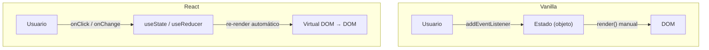
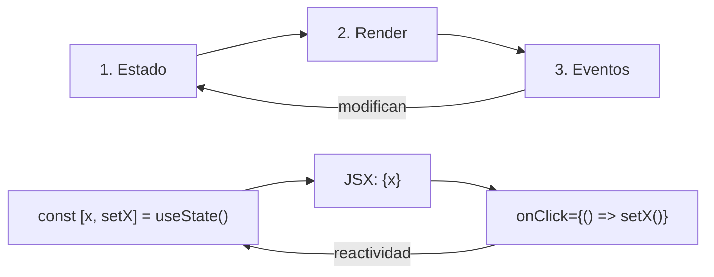
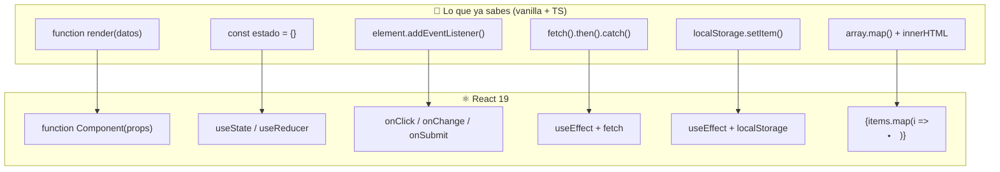

# 12. Preparación para React 19 desde TypeScript moderno

- [12. Preparación para React 19 desde TypeScript moderno](#12-preparación-para-react-19-desde-typescript-moderno)
  - [12.1. Checklist previa: ¿estoy listo?](#121-checklist-previa-estoy-listo)
    - [12.1.1. Lenguaje y datos](#1211-lenguaje-y-datos)
    - [12.1.2. Organización y reutilización](#1212-organización-y-reutilización)
    - [12.1.3. Navegador y UI](#1213-navegador-y-ui)
    - [12.1.4. Asincronía y APIs](#1214-asincronía-y-apis)
    - [12.1.5. Tabla resumen: patrón vanilla → React](#1215-tabla-resumen-patrón-vanilla--react)
  - [12.2. Patrones vanilla que se transforman en React](#122-patrones-vanilla-que-se-transforman-en-react)
    - [12.2.1. De `render()` a componente](#1221-de-render-a-componente)
    - [12.2.2. De estado manual a `useState`](#1222-de-estado-manual-a-usestate)
    - [12.2.3. De `addEventListener` a handlers declarativos](#1223-de-addeventlistener-a-handlers-declarativos)
    - [12.2.4. De `fetch` manual a efectos y servicios](#1224-de-fetch-manual-a-efectos-y-servicios)
    - [12.2.5. De `innerHTML` a JSX con listas](#1225-de-innerhtml-a-jsx-con-listas)
    - [12.2.6. De formularios vanilla a Actions](#1226-de-formularios-vanilla-a-actions)
    - [12.2.7. De `localStorage` manual a hooks de persistencia](#1227-de-localstorage-manual-a-hooks-de-persistencia)
  - [12.3. Ejemplo completo: la misma mini-app en los dos mundos](#123-ejemplo-completo-la-misma-mini-app-en-los-dos-mundos)
    - [12.3.1. Vanilla: gestor de tareas con estado + render + eventos](#1231-vanilla-gestor-de-tareas-con-estado--render--eventos)
    - [12.3.2. React 19: mismo gestor con componentes y hooks](#1232-react-19-mismo-gestor-con-componentes-y-hooks)
  - [12.4. Diagramas comparativos](#124-diagramas-comparativos)
    - [Flujo de datos en vanilla vs React](#flujo-de-datos-en-vanilla-vs-react)
    - [Ciclo estado, render y eventos (universal)](#ciclo-estado-render-y-eventos-universal)
    - [Flujo de interacción: imperativo vs declarativo](#flujo-de-interacción-del-usuario-imperativo-vs-declarativo)
    - [Traducción mental: lo que sabes → lo que usarás](#traducción-mental-lo-que-sabes--lo-que-usarás)
  - [12.5. Proyecto de cierre recomendado](#125-proyecto-de-cierre-recomendado)
  - [12.6. Material relacionado](#126-material-relacionado)

---

[Volver al índice general](../../index.md)

Esta unidad cierra el bloque de JavaScript (ahora **TypeScript**) y sirve de puente hacia React 19. No sustituye a un curso de frameworks: **ordena los conceptos que deben estar claros antes de empezar** y muestra cómo se transforman en patrones de framework.

> [!IMPORTANT]
> A lo largo de esta unidad encontrarás dos sabores: **TypeScript vanilla** (tipado con el `lib` DOM) y **React 19** (con JSX y, en proyectos TS, archivos `.tsx`). La lógica de negocio es idéntica en los dos; solo cambia el cableado con la UI.

> **Idea clave:** React no es un lenguaje nuevo. Es JavaScript con esteroides (y TypeScript lo usa de serie). Todo lo que haces en un framework tiene un equivalente en vanilla. Si entiendes el equivalente vanilla, el framework deja de ser magia.

---

## 12.1. Checklist previa: ¿estoy listo?

Antes de tocar React, repasa esto. Si algo falla, vuelve a la unidad correspondiente.

### 12.1.1. Lenguaje y datos

```typescript
// ¿Entiendes esto sin dudar? (Ya con tipos, como en todo el manual)
interface Alumno {
  nombre: string;
  notas: number[];
  curso?: string;
}

const alumnos: Alumno[] = [
  { nombre: "Profe", notas: [7, 8, 9] },
  { nombre: "Ana", notas: [5, 6, 7] },
];

// Función pura para la media (evita duplicar el código)
function conMedia(alumno: Alumno): Omit<Alumno, "curso"> & { media: number } {
  const media = alumno.notas.reduce((s, n) => s + n, 0) / alumno.notas.length;
  return { ...alumno, media };
}

// Transformar sin mutar: map, filter, reduce
const aprobados = alumnos
  .filter((a) => conMedia(a).media >= 5)
  .map(conMedia);

// Desestructurar
const [{ nombre: primero }] = aprobados; // "Profe"

// Spread para no mutar
const nuevoAlumno: Alumno = { ...alumnos[0], curso: "DI" };

// Set para valores únicos (los opcionales dan string | undefined)
const cursos = new Set(alumnos.map((a) => a.curso));
```

> [!NOTE]
> La función `conMedia` tienes que declararla antes de usarla: un `.map(conMedia)` con `this` o funciones tipo guarda que se llaman dentro de un callback son más fáciles de tipar si las declaras aparte. Si alguna de estas líneas te chirría, repasa las unidades 07-09 antes de seguir.

### 12.1.2. Organización y reutilización

```typescript
// Módulos ES: separar lógica en archivos pequeños (con extensión .ts)
// state.ts
export interface EstadoApp {
  tareas: string[];
  filtro: "todas" | "pendientes" | "completadas";
}

export const estado: EstadoApp = { tareas: [], filtro: "todas" };

// render.ts
export function renderTareas(tareas: string[]): string { /* ... */ }

// events.ts
export function bindEventos(): void { /* ... */ }

// app.ts — punto de entrada
import { estado } from "./state.ts";
import { renderTareas } from "./render.ts";
import { bindEventos } from "./events.ts";
```

Esa misma separación (`state.ts`, `render.ts`, `events.ts`) es la base mental para entender componentes, servicios y stores en React. Fíjate además en el tipo `filtro`: una **unión de literales** que modela el estado exactamente como lo pintará un selector o un `radio group`.

### 12.1.3. Navegador y UI

```typescript
// Delegación de eventos — patrón esencial en React
const lista = document.getElementById("lista");

lista?.addEventListener("click", (e: MouseEvent) => {
  const btn = (e.target as HTMLElement | null)?.closest("[data-accion]");
  if (!btn) return;
  const accion = btn.dataset.accion;  // "editar" | "borrar" (string)
  const id = btn.closest("li")?.dataset.id;
  // manejar accion...
});

// classList, dataset y atributos
const elemento = document.getElementById("miElemento");
elemento?.classList.toggle("activo");
console.log(elemento?.dataset.id);
elemento?.setAttribute("aria-expanded", "true");
```

> [!NOTE]
> Con `?.` (encadenamiento opcional) no hace falta un `if` para cada `getElementById`: si el elemento no existe, `elemento?.classList` es `undefined` y no revienta. Es el equivalente tipado del `if (elemento) { ... }`.

### 12.1.4. Asincronía y APIs

```typescript
// Patrón completo: carga + éxito + error + cancelación
async function cargarDatos(url: string, signal: AbortSignal): Promise<void> {
  try {
    renderCargando(true);                    // 1. UI: mostrar spinner
    const res = await fetch(url, { signal });
    if (!res.ok) throw new Error(`HTTP ${res.status}`);
    const datos: unknown = await res.json();
    renderExito(datos);                      // 2. UI: mostrar datos
  } catch (err) {
    if (err instanceof DOMException && err.name === "AbortError") return; // 3. Cancelado
    renderError(err instanceof Error ? err.message : "Error desconocido"); // 4. UI: error
  } finally {
    renderCargando(false);                   // 5. UI: ocultar spinner
  }
}

// Con AbortController para cancelar
const controller = new AbortController();
void cargarDatos("/api/alumnos", controller.signal);
// controller.abort(); // cancela si es necesario
```

> [!NOTE]
> `err` lo tipamos `unknown`: para leer `err.message` hay que estrechar con `err instanceof Error`. Y la cancelación es `AbortError` (un `DOMException`), no cualquier error. Este patrón de 5 estados (loading → success | error | aborted → done) es **exactamente** lo que se convierte en `useEffect` / `use`, o en loaders de React Router.

### 12.1.5. Tabla resumen: patrón vanilla → React

| Concepto vanilla (TS) | React 19 |
|:---|:---|
| `function render(datos)` | Componente (`function Component()`) |
| Objeto `estado` | `useState` / `useReducer` |
| `addEventListener` | `onClick`, `onChange`, `onSubmit` |
| `fetch` + `try/catch` | `useEffect` + `fetch` / React Query |
| `localStorage` | `useEffect` + estado / hook propio |
| `map()` para listas | `{items.map(i => <Item/>)}` |
| `if/else` condicional | `{cond && <Comp/>}` / ternario |
| `classList.toggle()` | `className` condicional / clsx |
| `FormData` | Actions / `useFormStatus` |
| Módulos ES | `import`/`export` componentes |
| `AbortController` | cleanup en `useEffect` |

---

## 12.2. Patrones vanilla que se transforman en React

Cada patrón se muestra en **dos versiones**: vanilla (TS) → React 19. Así ves la evolución.

### 12.2.1. De `render()` a componente

**Vanilla — una función que devuelve HTML:**

```typescript
interface Alumno {
  nombre: string;
  curso: string;
  media: number;
}

// La función render es el "componente" más primitivo
function renderAlumno(alumno: Alumno): string {
  return `
    <article class="alumno-card">
      <h2>${alumno.nombre}</h2>
      <p>Curso: ${alumno.curso}</p>
      <p>Nota media: ${alumno.media.toFixed(1)}</p>
    </article>
  `;
}

// Uso: insertar en el DOM
const app = document.getElementById("app");
if (app !== null) {
  const profe: Alumno = { nombre: "Profe", curso: "DI", media: 8.5 };
  app.innerHTML = renderAlumno(profe);
}
```

**React 19 — la función ES el componente:**

```tsx
// Misma idea, pero devuelve JSX (HTML dentro de JS) en vez de un string
interface AlumnoProps {
  alumno: { nombre: string; curso: string; media: number };
}

function AlumnoCard({ alumno }: AlumnoProps) {
  return (
    <article className="alumno-card">
      <h2>{alumno.nombre}</h2>
      <p>Curso: {alumno.curso}</p>
      <p>Nota media: {alumno.media.toFixed(1)}</p>
    </article>
  );
}

// Uso: React lo monta por ti, no necesitas innerHTML
// <AlumnoCard alumno={profe} />
```

> [!NOTE]
> En un proyecto TypeScript, los componentes React se guardan como `.tsx` (no `.jsx`), y las **props** se tipan con una `interface`: `{ alumno }: AlumnoProps`. Así `alumno.nombre` tira error de tipos si no existe.

> **Lo importante:** en ambos casos la idea es la misma — una función que recibe datos y devuelve UI. El framework añade reactividad, ciclo de vida y re-renderizado automático.

### 12.2.2. De estado manual a `useState`

**Vanilla — un objeto y una función que repinta:**

```typescript
interface Estado {
  contador: number;
}

// Estado: un simple objeto
const estado: Estado = { contador: 0 };

// Cada vez que cambia el estado, repintamos
function actualizarEstado(nuevoEstado: Partial<Estado>): void {
  Object.assign(estado, nuevoEstado);
  render(); // re-renderiza toda la UI
}

function incrementar(): void {
  actualizarEstado({ contador: estado.contador + 1 });
}

function render(): void {
  const app = document.getElementById("app");
  if (app === null) return;
  app.innerHTML = `
    <p>Contador: ${estado.contador}</p>
    <button id="btn-incrementar">+1</button>
  `;
  document.getElementById("btn-incrementar")?.addEventListener("click", incrementar);
}
```

> [!NOTE]
> `Partial<Estado>` deja pasar solo las claves que quieras cambiar: "estado parcial". Es la forma tipada de expresar "actualizo solo una parte".

**React 19 — `useState` vincula valor + setter:**

```tsx
import { useState } from "react";

function Contador() {
  const [contador, setContador] = useState(0); // ← estado reactivo

  return (
    <>
      <p>Contador: {contador}</p>
      {/* React re-renderiza automáticamente al llamar setContador */}
      <button onClick={() => setContador((c) => c + 1)}>+1</button>
    </>
  );
}
```

> **Diferencia clave:** en vanilla, tú llamas a `render()` manualmente. En React, el framework detecta el cambio de estado y repinta **solo lo necesario** automáticamente.

### 12.2.3. De `addEventListener` a handlers declarativos

**Vanilla — listener imperativo:**

```typescript
// Buscar el elemento, añadir listener, buscar otro elemento, añadir otro listener...
const btnGuardar = document.getElementById("btn-guardar");
const inputNombre = document.getElementById("input-nombre") as HTMLInputElement | null;

btnGuardar?.addEventListener("click", () => {
  const nombre = inputNombre?.value ?? "";
  console.log("Guardando:", nombre);
});

// Problema: si el elemento no existe aún (no se ha renderizado), el listener no se asigna.
// Solución vanilla: delegación de eventos o reasignar tras cada render.
```

**React — handlers declarativos en el JSX:**

```tsx
function Formulario() {
  const [nombre, setNombre] = useState("");

  function handleSubmit(e: React.FormEvent<HTMLFormElement>) {
    e.preventDefault();
    console.log("Guardando:", nombre);
  }

  return (
    <form onSubmit={handleSubmit}>
      {/* El listener va PEGADO al elemento en el JSX */}
      <input value={nombre} onChange={(e) => setNombre(e.target.value)} />
      <button type="submit">Guardar</button>
    </form>
  );
}
```

> [!NOTE]
> El evento tipado `React.FormEvent<HTMLFormElement>` es el equivalente a nuestro `SubmitEvent` del `lib` DOM: el componente genérico indica sobre qué elemento se dispara, y `e.target.value` queda tipado como `string`.

> **Lo importante:** en React no buscas elementos con `getElementById`. El handler va declarado donde está el elemento. Sin selectores, sin `addEventListener`, sin delegación manual.

### 12.2.4. De `fetch` manual a efectos y servicios

**Vanilla — fetch con gestión manual de estados:**

```typescript
interface Alumno {
  id: number;
  nombre: string;
}

let cargando = false;
let error: string | null = null;
let datos: Alumno[] | null = null;

async function cargarAlumnos(): Promise<void> {
  cargando = true; error = null; render();
  try {
    const res = await fetch("/api/alumnos");
    if (!res.ok) throw new Error(`Error ${res.status}`);
    datos = (await res.json()) as Alumno[];
  } catch (err) {
    error = err instanceof Error ? err.message : "Error desconocido";
  } finally {
    cargando = false;
    render();
  }
}

function render(): void {
  const app = document.getElementById("app");
  if (app === null) return;
  if (cargando) { app.innerHTML = "<p>Cargando...</p>"; return; }
  if (error) { app.innerHTML = `<p class='error'>${error}</p>`; return; }
  if (!datos) { app.innerHTML = "<p>Sin datos</p>"; return; }
  app.innerHTML = `<ul>${datos.map((a) => `<li>${a.nombre}</li>`).join("")}</ul>`;
}
```

> [!NOTE]
> `cargando`, `error`, `datos` forman una **suma de estados** (`null` para "sin datos"). Cuidado: `null` significa aquí "todavía nada", distinto de "vacio". En TS lo dejamos explícito con `T | null`.

**React 19 — `useEffect` + estado:**

```tsx
function ListaAlumnos() {
  const [datos, setDatos] = useState<Alumno[] | null>(null);
  const [cargando, setCargando] = useState(true);
  const [error, setError] = useState<string | null>(null);

  useEffect(() => {
    const controller = new AbortController(); // ← cancelar si el componente se desmonta

    async function cargar() {
      setCargando(true); setError(null);
      try {
        const res = await fetch("/api/alumnos", { signal: controller.signal });
        if (!res.ok) throw new Error(`Error ${res.status}`);
        setDatos((await res.json()) as Alumno[]);
      } catch (err) {
        if (err instanceof Error && err.name !== "AbortError") setError(err.message);
      } finally {
        setCargando(false);
      }
    }

    void cargar();
    return () => controller.abort(); // ← cleanup: cancela si el componente desaparece
  }, []); // ← array vacío = "solo al montar"

  if (cargando) return <p>Cargando...</p>;
  if (error) return <p className="error">{error}</p>;
  if (!datos) return <p>Sin datos</p>;
  return <ul>{datos.map((a) => <li key={a.id}>{a.nombre}</li>)}</ul>;
}
```

> **Lo que ganas:** en vanilla gestionas 3 variables (`cargando`, `error`, `datos`) y llamas a `render()` a mano. En React usas 3 `useState` (o un `useReducer`).

### 12.2.5. De `innerHTML` a JSX con listas

**Vanilla — concatenar strings:**

```typescript
interface Item {
  id: number;
  nombre: string;
}

function renderLista(items: Item[]): string {
  return `<ul>${items.map((item) => `<li>${item.nombre}</li>`).join("")}</ul>`;
}
// Problemas: sin escape automático (XSS), difícil de leer, sin eventos por elemento.
```

**React — JSX con `.map()`:**

```tsx
function Lista({ items }: { items: Item[] }) {
  return (
    <ul>
      {items.map((item) => (
        <li key={item.id}> {/* ← key es obligatorio para rendimiento */}
          {item.nombre}
          <button onClick={() => borrar(item.id)}>X</button>
        </li>
      ))}
    </ul>
  );
}
```

> [!IMPORTANT]
> El `innerHTML` vanilla **no escapa** el contenido: si `item.nombre` viene de un usuario, un valor como `` ejecuta código (XSS). JSX escapa por defecto. Cuando hagas `innerHTML` en vanilla, sanealo o usa `textContent`.

### 12.2.6. De formularios vanilla a Actions

**Vanilla — FormData manual:**

```typescript
const formAlumno = document.getElementById("form-alumno") as HTMLFormElement | null;

formAlumno?.addEventListener("submit", async (e: SubmitEvent) => {
  e.preventDefault();
  const objetivo = e.target;
  if (!(objetivo instanceof HTMLFormElement)) return;
  const formData = new FormData(objetivo);
  const datos = Object.fromEntries(formData) as Record<string, string>;

  // Validación manual
  const nombre = datos.nombre ?? "";
  if (!nombre || nombre.length < 3) {
    mostrarError("El nombre debe tener al menos 3 caracteres");
    return;
  }

  await fetch("/api/alumnos", {
    method: "POST",
    headers: { "Content-Type": "application/json" },
    body: JSON.stringify(datos),
  });
});
```

> [!NOTE]
> `Object.fromEntries(formData)` devuelve un objeto genérico: lo casteamos a `Record<string, string>` porque sabemos que todo valor de un `FormData` es `string` (o `File`). Navega con `datos.nombre ?? ""` para no tocar `undefined`.

**React 19 — Actions + `useFormStatus`:**

```tsx
import { useFormStatus } from "react-dom";

function FormAlumno() {
  async function crearAlumno(formData: FormData): Promise<{ error: string } | void> {
    // (si es Server Component, añade "use server"; entonces se ejecuta en el servidor)
    const nombre = formData.get("nombre")?.toString() ?? "";
    if (!nombre || nombre.length < 3) return { error: "Nombre muy corto" };
    // await db.alumnos.create({ nombre }); // (ejemplo conceptual)
  }

  return (
    <form action={crearAlumno}>
      <input name="nombre" required minLength={3} />
      <SubmitButton />
    </form>
  );
}

function SubmitButton() {
  const { pending } = useFormStatus(); // ← estado del envío sin estado manual
  return <button disabled={pending}>{pending ? "Guardando..." : "Guardar"}</button>;
}
```

> **Lo importante:** la validación (`longitud mínima`, `required`) existe en ambos mundos. En vanilla es `if (nombre.length < 3)`; en React un atributo o una función de acción. La idea no es nueva.

### 12.2.7. De `localStorage` manual a hooks de persistencia

**Vanilla:**

```typescript
// Guardar
localStorage.setItem("tema", JSON.stringify("oscuro"));

// Leer (con valor por defecto). getItem devuelve string | null
const guardado = localStorage.getItem("tema");
const tema = guardado ? (JSON.parse(guardado) as string) : "claro";

// Sincronizar con el estado — manual
state.tema = tema;
render();
```

> [!IMPORTANT]
> En TypeScript, `localStorage.getItem()` devuelve `string | null`: el casteo `JSON.parse(guardado) as string` es obligatorio porque el cuerpo guardado es solo un string cualquiera.

**React — hook personalizado:**

```tsx
function useLocalStorage<T>(clave: string, valorInicial: T) {
  const [valor, setValor] = useState<T>(() => {
    const guardado = localStorage.getItem(clave);
    return guardado ? (JSON.parse(guardado) as T) : valorInicial;
  });

  useEffect(() => {
    localStorage.setItem(clave, JSON.stringify(valor));
  }, [clave, valor]);

  return [valor, setValor] as const;
}

// Uso: igual que useState, pero persiste automáticamente
const [tema, setTema] = useLocalStorage<string>("tema", "claro");
```

> [!NOTE]
> El hook es **genérico**: `useLocalStorage<T>` se especializa en el tipo que le pases (`useLocalStorage<string>("tema", ...)`). Es el mismo poder de `Map<K,V>` o `Promise<T>` llevado a tus propias funciones.

---

## 12.3. Ejemplo completo: la misma mini-app en los dos mundos

Un gestor de tareas mínimo: añadir tarea, marcar como completada, eliminar. Misma funcionalidad, dos implementaciones.

### 12.3.1. Vanilla: gestor de tareas con estado + render + eventos

```typescript
// state.ts — un solo objeto, nada de clases
export interface Tarea {
  id: number;
  texto: string;
  completada: boolean;
}

export interface Estado {
  tareas: Tarea[];
  siguienteId: number;
}

export const estado: Estado = {
  tareas: [
    { id: 1, texto: "Aprender JavaScript moderno", completada: true },
    { id: 2, texto: "Entender el DOM", completada: false },
  ],
  siguienteId: 3,
};
```

```typescript
// render.ts — función pura: estado entra, HTML sale
import type { Estado } from "./state.ts";

export function render(estado: Estado): string {
  return `
    <div id="app-gestor">
      <h1>Gestor de tareas (Vanilla + TS)</h1>
      <form id="form-tarea">
        <input id="input-tarea" type="text" placeholder="Nueva tarea..." autocomplete="off" />
        <button type="submit">Añadir</button>
      </form>
      <ul id="lista-tareas">
        ${estado.tareas
          .map(
            (t) => `
          <li class="${t.completada ? "completada" : ""}" data-id="${t.id}">
            <span>${t.texto}</span>
            <button data-accion="toggle">${t.completada ? "✓" : "○"}</button>
            <button data-accion="borrar">✕</button>
          </li>
        `
          )
          .join("")}
      </ul>
      <p>${estado.tareas.filter((t) => !t.completada).length} pendientes</p>
    </div>
  `;
}
```

```typescript
// events.ts — delegación de eventos sobre el contenedor principal
import type { Estado } from "./state.ts";

export function bindEventos(estado: Estado, repintar: () => void): void {
  const app = document.getElementById("app-gestor");
  if (app === null) return;

  app.querySelector("#form-tarea")?.addEventListener("submit", (e: SubmitEvent) => {
    e.preventDefault();
    const input = app.querySelector<HTMLInputElement>("#input-tarea");
    const texto = input?.value.trim() ?? "";
    if (!texto) return;
    estado.tareas = [...estado.tareas, { id: estado.siguienteId++, texto, completada: false }];
    if (input) input.value = "";
    repintar();
  });

  app.querySelector("#lista-tareas")?.addEventListener("click", (e: MouseEvent) => {
    const btn = (e.target as HTMLElement | null)?.closest("button[data-accion]");
    if (!btn) return;
    const id = Number(btn.closest("li")?.dataset.id);
    if (btn.dataset.accion === "toggle") {
      estado.tareas = estado.tareas.map((t) =>
        t.id === id ? { ...t, completada: !t.completada } : t
      );
    } else if (btn.dataset.accion === "borrar") {
      estado.tareas = estado.tareas.filter((t) => t.id !== id);
    }
    repintar();
  });
}
```

```typescript
// app.ts — punto de entrada
import { estado } from "./state.ts";
import { render } from "./render.ts";
import { bindEventos } from "./events.ts";

function repintar(): void {
  const app = document.getElementById("app");
  if (app === null) return;
  app.innerHTML = render(estado);
  bindEventos(estado, repintar);
}

repintar();
```

> [!NOTE]
> `estado` es un objeto **mutable** (se muta desde `bindEventos`), pero los cambios siempre crean un **nuevo array** (`[...estado.tareas]`, `.map`, `.filter`) y luego se pinta todo de nuevo: es la idea de "inmutabilidad de datos" que React convierte en reactividad.

Sigue leyendo para ver la misma lógica con componentes y hooks.

### 12.3.2. React 19: mismo gestor con componentes y hooks

```tsx
import { useState } from "react";

interface Tarea {
  id: number;
  texto: string;
  completada: boolean;
}

// App.tsx — todo en un solo archivo para ver la comparación
export default function GestorTareas() {
  const [tareas, setTareas] = useState<Tarea[]>([
    { id: 1, texto: "Aprender JavaScript moderno", completada: true },
    { id: 2, texto: "Entender el DOM", completada: false },
  ]);
  const [texto, setTexto] = useState("");

  function añadir(e: React.FormEvent<HTMLFormElement>): void {
    e.preventDefault();
    const trimmed = texto.trim();
    if (!trimmed) return;
    setTareas([...tareas, { id: Date.now(), texto: trimmed, completada: false }]);
    setTexto("");
  }

  function toggle(id: number): void {
    setTareas(tareas.map((t) => (t.id === id ? { ...t, completada: !t.completada } : t)));
  }

  function borrar(id: number): void {
    setTareas(tareas.filter((t) => t.id !== id));
  }

  const pendientes = tareas.filter((t) => !t.completada).length;

  return (
    <div>
      <h1>Gestor de tareas (React 19)</h1>
      <form onSubmit={añadir}>
        <input value={texto} onChange={(e) => setTexto(e.target.value)} placeholder="Nueva tarea..." />
        <button type="submit">Añadir</button>
      </form>
      <ul>
        {tareas.map((t) => (
          <li key={t.id} className={t.completada ? "completada" : ""}>
            <span>{t.texto}</span>
            <button onClick={() => toggle(t.id)}>{t.completada ? "✓" : "○"}</button>
            <button onClick={() => borrar(t.id)}>✕</button>
          </li>
        ))}
      </ul>
      <p>{pendientes} pendientes</p>
    </div>
  );
}
```

> [!IMPORTANT]
> **Fíjate en lo que NO cambia:** la lógica de negocio (`toggle`, `borrar`, `añadir`) es JavaScript/TypeScript puro en ambos casos, con las mismas funciones de array (`map`, `filter`, spread). Lo que cambia es cómo se conecta esa lógica con la UI. El framework se ocupa del cableado.

---

## 12.4. Diagramas comparativos

**Flujo de datos en vanilla vs React:**



**Ciclo estado, render y eventos (universal):**



**Flujo de interacción del usuario: imperativo vs declarativo:**

```mermaid
sequenceDiagram
  participant U as 👤 Usuario
  participant V as Vanilla
  participant R as React

  rect rgb(40, 40, 50)
    Note over U,V: Imperativo (vanilla)
    U->>V: Escribe en input
    V->>V: addEventListener('input', handler)
    U->>V: Click en botón
    V->>V: addEventListener('click', handler)
    V->>V: Leer input.value
    V->>V: Validar manualmente
    V->>V: Actualizar estado
    V->>V: Llamar a render()
    V->>V: innerHTML = nuevoHTML
    V->>V: Reasignar listeners
  end

  rect rgb(50, 40, 40)
    Note over U,R: Declarativo (React)
    U->>R: Escribe en input
    R->>R: El framework detecta el cambio
    U->>R: Click en botón
    R->>R: El framework invoca el handler
    R->>R: setState
    R->>R: El framework repinta solo lo necesario
  end
```



**Traducción mental: lo que sabes → lo que usarás:**



---

## 12.5. Proyecto de cierre recomendado

Crear un **gestor académico** con las siguientes funcionalidades, primero en vanilla y luego en React 19:

- **CRUD de tareas/entregas**: crear, leer, actualizar, eliminar.
- **Filtros por estado**: todas, pendientes, completadas.
- **Búsqueda por texto**.
- **Persistencia en `localStorage`**: que al recargar no se pierdan las tareas.
- **Carga inicial desde API**: simular con `jsonplaceholder` o una API fake.
- **Estados visuales**: spinner de carga, mensaje de error, estado vacío.
- **Separación en módulos**: `state.ts`, `render.ts`, `events.ts`, `storage.ts`, `api.ts` (modela con `interface` cada dato que entre y salga de la API).
- **Validación**: no permitir tareas vacías.
- **Versión posterior en React 19 (con Vite + el template TS)**: reimplementar la misma app con componentes y hooks.

> **Regla de oro:** si tu versión vanilla tiene `estado`, `render()`, eventos, validación, `fetch`, `localStorage` y está modularizada (y tipada), pasarla a React es un ejercicio de traducción, no de reescritura.

---

## 12.6. Material relacionado

- [Ejercicios autocorregibles](../../../repos/05-testing/tests-ejercicios-ts/)
- [Índice general](../../index.md)

---

### 📦 En el repositorio (`repos/02-react-componentes/src/patterns/AdvancedFunctions.ts`)

```typescript
/**
 * AdvancedFunctions.ts - Patrones avanzados de funciones
 * Fuente: Sesión 04 - Patrones avanzados de funciones
 * IIFE, recursión, closures, composición de funciones
 */

// --- Declaraciones, expresiones y arrow functions ---
// Declaración de función (hoisting)
function sumar(a: number, b: number): number {
  return a + b;
}

// Expresión de función
const multiplicar = function (a: number, b: number): number {
  return a * b;
};

// Arrow function
const dividir = (a: number, b: number): number => a / b;

// Arrow multilínea
const procesar = (items: number[]): number[] =>
  items
    .filter((n) => n > 0)
    .map((n) => n * 2)
    .sort((a, b) => a - b);

// --- Parámetros por defecto, rest y spread ---
// Parámetros por defecto
function saludar(nombre: string, saludo: string = "Hola"): string {
  return `${saludo}, ${nombre}`;
}

// Rest parameters
function sumarTodos(...numeros: number[]): number {
  return numeros.reduce((acc, n) => acc + n, 0);
}

// --- IIFE (Immediately Invoked Function Expression) ---
// IIFE clásica
(function () {
  const privado = "solo aquí";
  console.log(privado);
})();

// IIFE con arrow
(() => {
  const mensaje: string = "Ejecutada al instante";
  console.log(mensaje);
})();

// IIFE con parámetros
((nombre: string) => {
  console.log(`Hola, ${nombre}`);
})("TypeScript");

// --- Recursión tipada ---
function factorial(n: number): number {
  if (n <= 1) return 1;
  return n * factorial(n - 1);
}

function fibonacci(n: number, memoria: Map<number, number> = new Map()): number {
  if (n <= 1) return n;
  if (memoria.has(n)) return memoria.get(n)!;

  const resultado = fibonacci(n - 1, memoria) + fibonacci(n - 2, memoria);
  memoria.set(n, resultado);
  return resultado;
}

// --- Clausuras (closures) para factories ---
type Operacion = (x: number) => number;

function crearMultiplicador(factor: number): Operacion {
  return (x: number) => x * factor;
}

const duplicar = crearMultiplicador(2);
const triplicar = crearMultiplicador(3);

// --- Composición de funciones ---
function compose<T>(...fns: Array<(arg: T) => T>): (arg: T) => T {
  return (x: T) => fns.reduceRight((acc, fn) => fn(acc), x);
}

const agregarIVA = (precio: number): number => precio * 1.21;
const redondear = (precio: number): number => Math.round(precio * 100) / 100;
const formatear = (precio: number): string => `${precio.toFixed(2)}€`;

const calcularPrecioFinal = compose(redondear, agregarIVA);

export {
  sumar,
  multiplicar,
  dividir,
  procesar,
  saludar,
  sumarTodos,
  factorial,
  fibonacci,
  crearMultiplicador,
  duplicar,
  triplicar,
  compose,
  agregarIVA,
  redondear,
  formatear,
  calcularPrecioFinal,
};

export type { Operacion };
```

### 📦 En el repositorio (`repos/02-react-componentes/src/patterns/CleanCode.ts`)

```typescript
/**
 * CleanCode.ts - Principios de Clean Code en TypeScript
 * Fuente: Sesión 04 - Patrones de Clean Code
 * Nombres significativos, única responsabilidad, inmutabilidad
 */

// --- Nombres significativos ---
// ❌ Malo
export function proc(d: number[]): number {
  return d.filter((x) => x > 0).reduce((a, b) => a + b, 0) / d.length;
}

// ✅ Bueno
function calcularPromedioPositivos(numeros: number[]): number {
  const positivos = numeros.filter((n) => n > 0);
  if (positivos.length === 0) return 0;
  return positivos.reduce((suma, n) => suma + n, 0) / positivos.length;
}

// --- Funciones de una sola responsabilidad ---
// ❌ Malo: hace demasiadas cosas
export function procesarUsuario(datos: unknown): void {
  const usuario = datos as { nombre: string; email: string };
  if (!usuario.nombre || !usuario.email) throw new Error("Datos inválidos");
  fetch("/api/usuarios", { method: "POST", body: JSON.stringify(usuario) });
  localStorage.setItem("ultimoUsuario", JSON.stringify(usuario));
}

// ✅ Bueno: cada función hace una cosa
export function validarUsuario(datos: unknown): asserts datos is { nombre: string; email: string } {
  if (typeof datos !== "object" || !datos) throw new Error("Datos inválidos");
  if (!("nombre" in datos) || !("email" in datos)) throw new Error("Faltan campos");
}

export async function guardarUsuario(usuario: { nombre: string; email: string }): Promise<Response> {
  return fetch("/api/usuarios", {
    method: "POST",
    headers: { "Content-Type": "application/json" },
    body: JSON.stringify(usuario),
  });
}

export function persistirLocalmente(usuario: Record<string, unknown>): void {
  localStorage.setItem("ultimoUsuario", JSON.stringify(usuario));
}

// --- Inmutabilidad ---
// ❌ Mutación
export function agregarTarea(tareas: string[], nueva: string): string[] {
  tareas.push(nueva);
  return tareas;
}

// ✅ Inmutabilidad con spread
function agregarTareaInmutable(tareas: readonly string[], nueva: string): string[] {
  return [...tareas, nueva];
}

// ✅ Inmutabilidad con map/filter/reduce
function actualizarEstado(
  tareas: ReadonlyArray<{ id: number; done: boolean }>,
  id: number
): ReadonlyArray<{ id: number; done: boolean }> {
  return tareas.map((t) => (t.id === id ? { ...t, done: true } : t));
}

// --- Separación de datos, UI y lógica ---
// 📁 datos.ts
type Estado = "pendiente" | "completada";

interface Tarea {
  id: string;
  texto: string;
  estado: Estado;
}

// 📁 logica.ts
function crearTarea(texto: string): Tarea {
  return { id: crypto.randomUUID(), texto: texto.trim(), estado: "pendiente" };
}

function filtrarPorEstado(tareas: Tarea[], estado: Estado): Tarea[] {
  return tareas.filter((t) => t.estado === estado);
}

// 📁 ui.ts
function renderizarTarea(tarea: Tarea): HTMLElement {
  const div = document.createElement("div");
  div.textContent = tarea.texto;
  div.dataset.id = tarea.id;
  return div;
}

export {
  calcularPromedioPositivos,
  agregarTareaInmutable,
  actualizarEstado,
  crearTarea,
  filtrarPorEstado,
  renderizarTarea,
};

export type { Estado, Tarea };
```

### 📦 En el repositorio (`repos/02-react-componentes/src/state/localStorage.ts`)

```typescript
/**
 * localStorage.ts - Persistencia en el navegador
 * Fuente: Sesión 05 - localStorage
 * Operaciones básicas, objetos JSON tipados, sessionStorage
 */

// --- Operaciones básicas ---
// localStorage.setItem("nombre", "Ana");
// const nombre = localStorage.getItem("nombre"); // string | null
// localStorage.removeItem("nombre");
// localStorage.clear();
// console.log(localStorage.length);

// --- Guardar y recuperar objetos (JSON) ---

interface UsuarioPersistente {
  id: string;
  nombre: string;
  ultimoAcceso: string;
}

function guardarUsuario(usuario: UsuarioPersistente): void {
  localStorage.setItem(`usuario:${usuario.id}`, JSON.stringify(usuario));
}

function obtenerUsuario(id: string): UsuarioPersistente | null {
  const raw = localStorage.getItem(`usuario:${id}`);
  if (!raw) return null;
  return JSON.parse(raw) as UsuarioPersistente;
}

// --- sessionStorage ---

function demoSessionStorage(): void {
  sessionStorage.setItem("temporal", "dato efímero");
  console.log(sessionStorage.getItem("temporal"));
}

// --- Gestión de estado con localStorage ---

type FiltroApp = "todas" | "pendientes" | "completadas";

interface TareaPersistente {
  id: string;
  texto: string;
  completada: boolean;
}

interface EstadoApp {
  tareas: TareaPersistente[];
  filtro: FiltroApp;
}

function cargarEstado(): EstadoApp {
  const raw = localStorage.getItem("estado-app");
  if (!raw) return { tareas: [], filtro: "todas" };
  return JSON.parse(raw) as EstadoApp;
}

function guardarEstado(estado: EstadoApp): void {
  localStorage.setItem("estado-app", JSON.stringify(estado));
}

// --- Seguridad: no almacenar tokens sensibles ---
// ❌ Inseguro: localStorage.setItem("token", jwtToken);
// ✅ Seguro: cookie HttpOnly (solo el servidor la lee)

export {
  guardarUsuario,
  obtenerUsuario,
  demoSessionStorage,
  cargarEstado,
  guardarEstado,
};

export type { UsuarioPersistente, EstadoApp, TareaPersistente, FiltroApp };
```

---

[Volver al índice general](../../index.md)