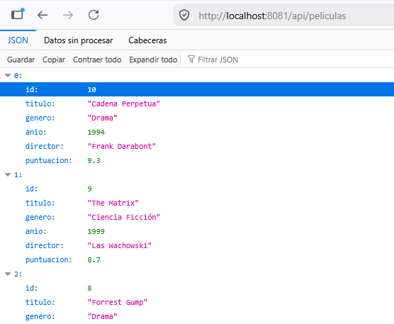
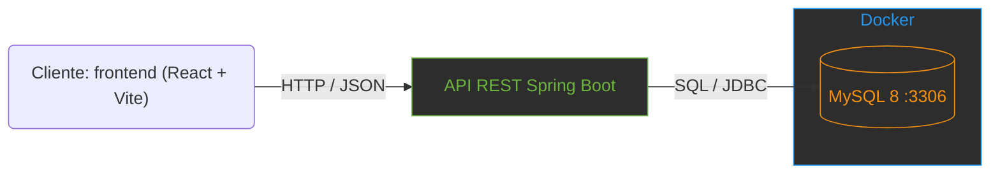
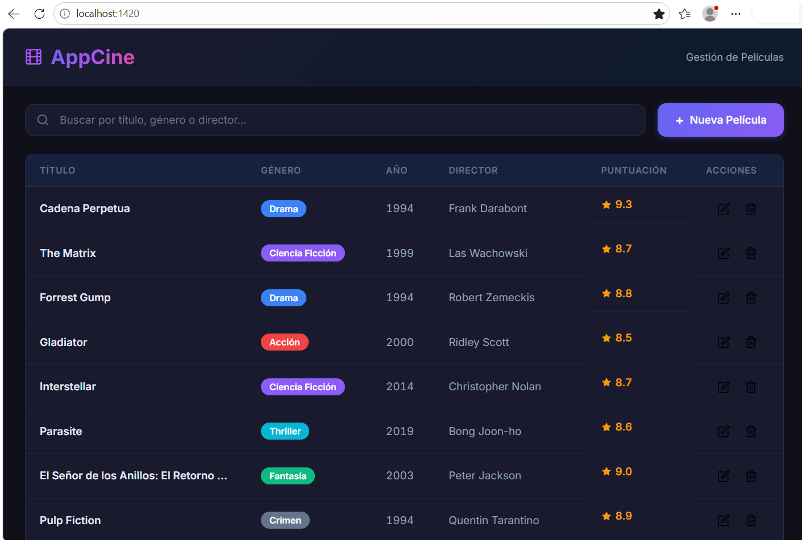
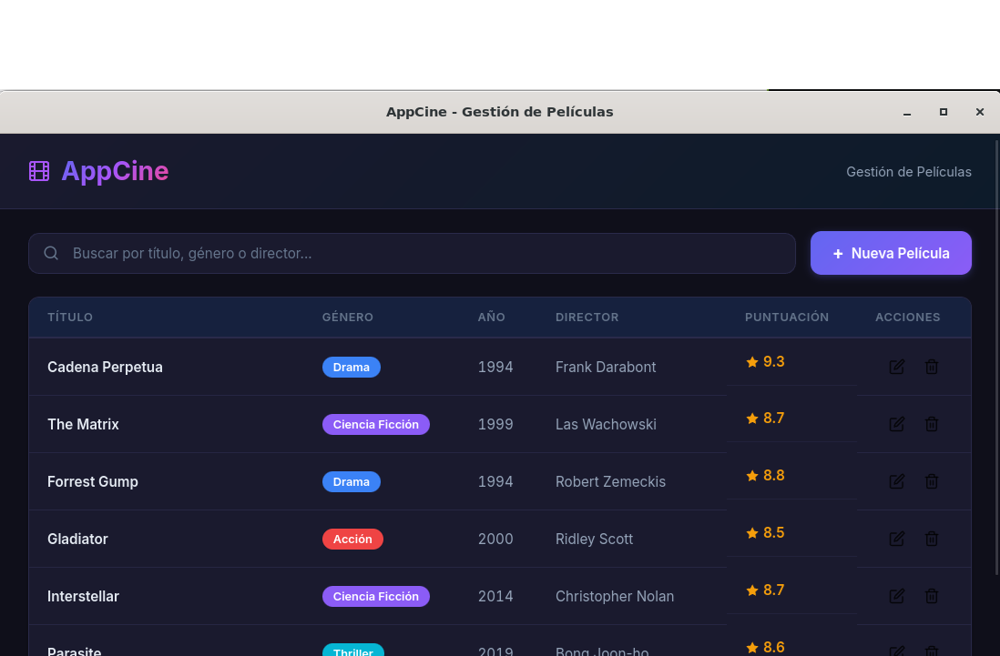
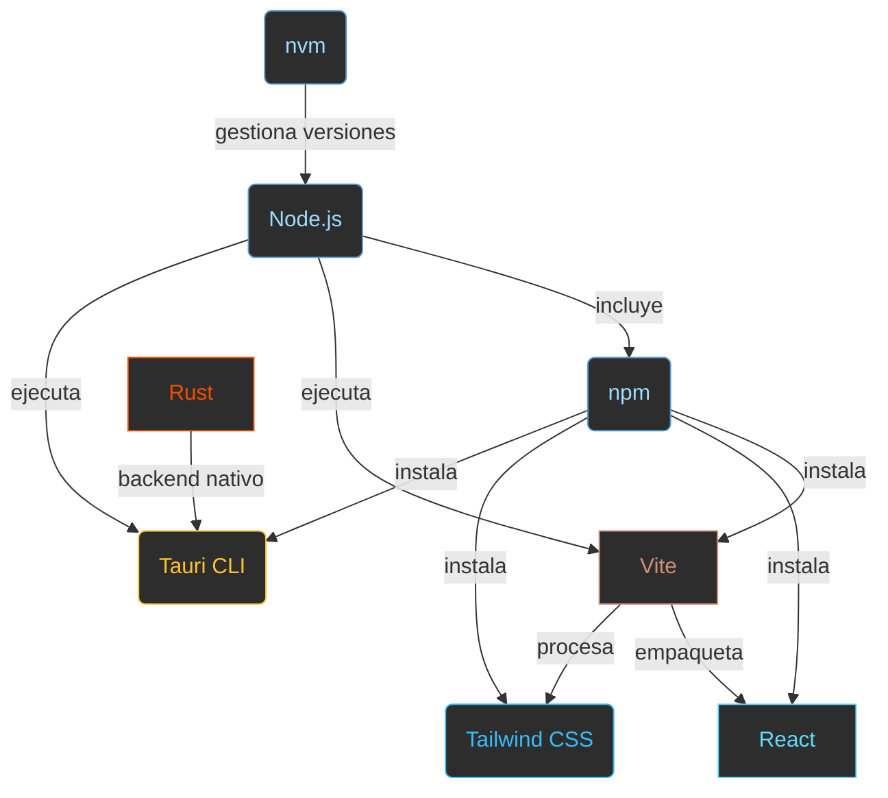

# Sesión 0: Fundamentos de Arquitectura y Configuración del Entorno

Node.js, NPM, Vite, React, Tailwind CSS, Rust y Tauri

[← Volver al Índice](index.md)

---

## Tauri vs Electron: ¿Por qué Tauri?

### ¿Qué es Tauri?

Tauri es un framework de código abierto para crear aplicaciones de escritorio usando tecnologías web en el frontend (HTML, CSS, JavaScript/TypeScript) y un backend nativo escrito en Rust. A diferencia de Electron, que incluye un navegador completo (Chromium) en cada aplicación, Tauri se apoya en el **WebView nativo** del sistema operativo (Edge WebView2 en Windows, WebKit en macOS/Linux), lo que lo hace extremadamente ligero.

> **Arquitectura Tauri:** Frontend (React/Vue/Svelte) se ejecuta en el WebView del SO → se comunica con el backend Rust a través de un canal IPC seguro → el backend accede al sistema de archivos, base de datos, etc. de forma controlada.

### ¿Por qué elegir Tauri sobre Electron?

| Criterio |  Tauri |  Electron |
| --- | --- | --- |
| **Backend** | Rust (nativo, rápido, seguro en memoria) | Node.js (JavaScript, single-threaded) |
| **Tamaño del bundle** | ~2-5 MB (usa el WebView del sistema) | ~80-200 MB (incluye Chromium completo) |
| **Memoria RAM** | ~30-50 MB en idle | ~100-200 MB en idle (Chromium) |
| **Rendimiento** | Empaquetado nativo, arranque rápido | Empaquetado con V8, más pesado |
| **Seguridad** | Permisos explícitos, sandbox estricto | Node.js tiene acceso amplio al SO |
| **Frontend** | Cualquier framework web (React, Vue, Svelte...) | Cualquier framework web (React, Vue, Svelte...) |
| **Soporte SO** | Windows, macOS, Linux | Windows, macOS, Linux |
| **Comunidad** | Creciente rápido, respaldado por empresa | Madura, amplia documentación |
| **Ejemplos** | Cap, GitButler, Ente, etc. | VS Code, Discord, Slack, Figma, Notion, Spotify, etc. |

> **En resumen:** Tauri es más ligero, más rápido y más seguro que Electron. La diferencia principal es que Tauri usa el WebView nativo del sistema operativo mientras que Electron incluye Chromium completo, lo que explica la gran diferencia en tamaño y memoria.

> **Nota:** Electron sigue siendo una opción válida para aplicaciones que necesitan el máximo control sobre el rendering. Pero para la mayoría de aplicaciones de escritorio, Tauri ofrece mejor rendimiento con menos recursos.

## Ejemplo de miniaplicación

Uno de los objetivos de la asignatura es crear **aplicaciones de escritorio responsivas**, con acceso a **base de datos** y que a la vez sean **multiplataforma**. Una forma muy ágil de conseguir esto es mediante aplicaciones híbridas. Es decir, interfaces que se comportan como una app nativa pero están construidas con tecnologías web y pueden desplegarse en cualquier plataforma.

A continuación se muestra una miniaplicación de ejemplo que sigue esta arquitectura completa:



API REST SpringBoot (acceso a MySQL bajo Docker)





Web expuesta por Vite



App de Escritorio


App de Escritorio con ventana emergente de inserción

> **Arquitectura:** Backend (SpringBoot + MySQL en Docker) → API REST → Frontend (React + Vite) → Empaquetado como app de escritorio (Tauri). La misma base de código sirve para la versión web y la versión de escritorio.

## Mapa de Relaciones del Ecosistema

Diagrama que muestra cómo se relacionan las herramientas del entorno de desarrollo:

> **nvm** — el que instala y cambia entre versiones de Node
> **Node.js** — el motor que ejecuta JavaScript/TypeScript fuera del navegador
> **npm** — el gestor que instala librerías y herramientas
> **Vite** — el empaquetador que compila y sirve el frontend en caliente
> **React** — la librería de componentes para la interfaz de usuario
> **Tailwind CSS** — el framework de estilos con clases utilitarias
> **Tauri CLI** — la herramienta que envuelve la web en una ventana nativa
> **Rust** — el lenguaje detrás del backend nativo de Tauri



## Node.js: Entorno de Ejecución

Node.js es un entorno de ejecución de JavaScript/TypeScript basado en el motor V8 de Chrome. Permite ejecutar JavaScript/TypeScript fuera del navegador, necesario para las herramientas de desarrollo.

```bash
# Verificar instalacion de Node.js
node --version
# Output: v22.x.x

npm --version
# Output: 10.x.x
```

### Ejemplo: Servidor HTTP básico con Node.js

```javascript
const http = require('http');

const server = http.createServer((req, res) => {
    res.writeHead(200, { 'Content-Type': 'text/plain' });
    res.end('Hola desde Node.js!');
});

server.listen(3000, () => {
    console.log('Servidor corriendo en http://localhost:3000');
});
```

## NPM y Gestión de Paquetes

Node.js incluye npm (Node Package Manager), el gestor de paquetes más grande del ecosistema JavaScript/TypeScript. Permite instalar, actualizar y gestionar dependencias de forma declarativa.

### package.json

El archivo `package.json` es el corazón de cualquier proyecto Node. Contiene metadatos, scripts y dependencias.

```json
{
  "name": "mi-proyecto",
  "version": "1.0.0",
  "description": "Proyecto de ejemplo",
  "type": "module",
  "scripts": {
    "dev": "vite",
    "build": "tsc -b && vite build",
    "preview": "vite preview"
  },
  "dependencies": {
    "react": "^19.0.0",
    "react-dom": "^19.0.0"
  },
  "devDependencies": {
    "typescript": "^5.7.0",
    "vite": "^6.0.0",
    "@vitejs/plugin-react": "^4.3.0"
  }
}
```

### Scripts personalizados

Los scripts se ejecutan con `npm run <nombre>`. npm expone binarios locales en `PATH` durante la ejecución.

```bash
# Ejecutar servidor de desarrollo
npm run dev

# Compilar y construir para producción
npm run build
```

### Instalación de dependencias

```bash
# Inicializar un proyecto
npm init -y

# Instalar todas las dependencias del package.json
npm install

# Instalar una dependencia de producción
npm install react react-dom

# Instalar una dependencia de desarrollo
npm install -D typescript @types/react @types/react-dom

# Instalar Tauri CLI
npm install -D @tauri-apps/cli

# Instalar una version especifica
npm install react@19.0.0
```

### nvm (Node Version Manager)

Permite instalar y cambiar entre versiones de Node.js.

```bash
# Instalar una version especifica
nvm install 24

# Usar una version
nvm use 24

# Version por defecto
nvm alias default 24

# Ver versiones instaladas
nvm ls
```

> El archivo `.nvmrc` en la raíz del proyecto especifica la versión requerida. npm ejecuta automáticamente `nvm use` si esta configurado.

## Vite: Empaquetador Moderno

Vite proporciona un servidor de desarrollo con recarga instantánea (HMR) y empaquetado optimizado para producción.

```bash
# Crear proyecto con Vite
npm create vite@latest mi-app -- --template react-ts

# Estructura generada
mi-app/
  index.html
  package.json
  tsconfig.json
  vite.config.ts
  src/
    main.tsx
    App.tsx
    App.css
```

### Configuración de Vite (vite.config.ts)

```typescript
import { defineConfig } from "vite";
import react from "@vitejs/plugin-react";

export default defineConfig({
  plugins: [react()],
  server: {
    port: 5173,
    open: true,
  },
  build: {
    outDir: "dist",
    sourcemap: true,
  },
});
```

## React: Librería de Interfaces

React permite construir interfaces de usuario mediante componentes reutilizables con estado propio.

```tsx
// App.tsx - Componente básico
import { useState } from 'react';

function App() {
    const [count, setCount] = useState(0);

    return (
        <div>
            <h1>Contador: {count}</h1>
            <button onClick={() => setCount(count + 1)}>
                Incrementar
            </button>
        </div>
    );
}

export default App;
```

## Tailwind CSS: Framework Utilitario

Tailwind CSS permite diseñar interfaces rapidamente usando clases predefinidas directamente en el JSX.

```tsx
// Instalacion
npm install -D tailwindcss postcss autoprefixer
npx tailwindcss init -p

// tailwind.config.js
export default {
    content: ["./index.html", "./src/**/*.{js,ts,jsx,tsx}"],
    theme: { extend: {} },
    plugins: [],
};

// index.css
@tailwind base;
@tailwind components;
@tailwind utilities;

// Uso en componente
function Tarjeta() {
    return (
        <div className="bg-white shadow-lg rounded-xl p-6 hover:shadow-xl transition">
            <h2 className="text-xl font-bold text-gray-800">Titulo</h2>
            <p className="text-gray-600 mt-2">Contenido de la tarjeta.</p>
        </div>
    );
}
```

## Rust: Lenguaje de Sistema

Rust es el lenguaje que impulsa el backend de Tauri. Destaca por su seguridad de memoria sin necesidad de recolector de basura.

```rust
// Verificar instalacion
rustc --version
cargo --version

// Hola mundo en Rust
fn main() {
    println!("Hola desde Rust!");

    let mensaje = "Tauri usa Rust";
    println!("Mensaje: {}", mensaje);
}
```

## Tauri: El Puente

Tauri conecta el frontend web con el sistema operativo a través de Rust, ofreciendo aplicaciones de escritorio nativas, seguras y ligeras.

### Estructura de Tauri

```
src-tauri/
  Cargo.toml          # Dependencias Rust del proyecto Tauri
  tauri.conf.json     # Configuración de la aplicacion (ventana, permisos, etc.)
  capabilities/       # Permisos de la aplicacion
  src/
    main.rs           # Punto de entrada (Windows, macOS, Linux)
    lib.rs            # Logica principal de Tauri
```

### Comandos Tauri principales

```bash
# Ejecutar en modo desarrollo (ventana nativa + HMR)
npx tauri dev

# Compilar para producción
npx tauri build

# El binario generado estara en:
# src-tauri/target/release/tauri-ipc-filesystem
```

### Ejemplo: Comando personalizado Rust + invocación TypeScript

`src-tauri/src/lib.rs`:

> 📦 **Este código está en el repositorio:** `repos/03-tauri-ipc-filesystem/src-tauri/src/lib.rs`

```rust
use std::fs;
use tauri::Manager;

#[tauri::command]
fn greet(name: &str) -> String {
    format!("Hola desde Rust, {}!", name)
}

#[tauri::command]
fn saludar(nombre: &str) -> String {
    format!("Hola, {}! Bienvenido a Tauri.", nombre)
}

#[tauri::command]
fn sumar(a: i32, b: i32) -> i32 {
    a + b
}

#[tauri::command]
fn obtener_info_sistema() -> Result<String, String> {
    let os = std::env::consts::OS;
    let arch = std::env::consts::ARCH;
    Ok(format!("SO: {}, Arquitectura: {}", os, arch))
}

#[tauri::command]
fn leer_archivo(ruta: String) -> Result<String, String> {
    fs::read_to_string(&ruta).map_err(|e| e.to_string())
}

#[tauri::command]
fn escribir_archivo(ruta: String, contenido: String) -> Result<(), String> {
    fs::write(&ruta, &contenido).map_err(|e| e.to_string())
}

#[tauri::command]
fn listar_directorio(ruta: String) -> Result<Vec<String>, String> {
    let entries = fs::read_dir(&ruta).map_err(|e| e.to_string())?;
    let mut archivos = Vec::new();
    for entry in entries {
        let entry = entry.map_err(|e| e.to_string())?;
        archivos.push(entry.file_name().to_string_lossy().to_string());
    }
    Ok(archivos)
}

#[cfg_attr(mobile, tauri::mobile_entry_point)]
pub fn run() {
    tauri::Builder::default()
        .invoke_handler(tauri::generate_handler![
            greet,
            saludar,
            sumar,
            obtener_info_sistema,
            leer_archivo,
            escribir_archivo,
            listar_directorio
        ])
        .run(tauri::generate_context!())
        .expect("error al ejecutar Tauri");
}
```

Llamar al comando desde TypeScript:

```typescript
import { invoke } from '@tauri-apps/api/core'

const mensaje = await invoke('saludar', { nombre: 'Estudiante' })
console.log(mensaje) // "Hola desde Rust, Estudiante!"
```

---

[Índice](index.md) [S0](sesion00.md) [S1](sesion01.md) [S2](sesion02.md) [S3](sesion03.md) [S4](sesion04.md) [S5](sesion05.md) [S6](sesion06.md) [S7](sesion07.md) [S8](sesion08.md) [S9](sesion09.md) [S10](sesion10.md) [S11](sesion11.md) [S12](sesion12.md)
