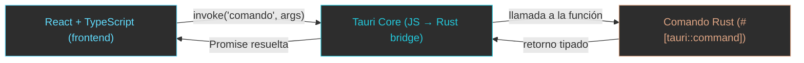
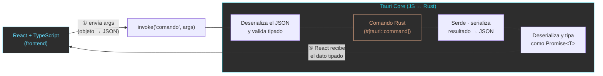
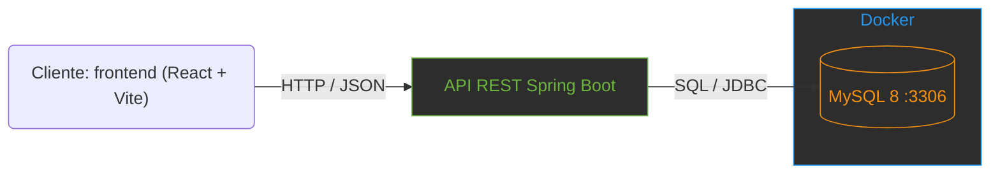
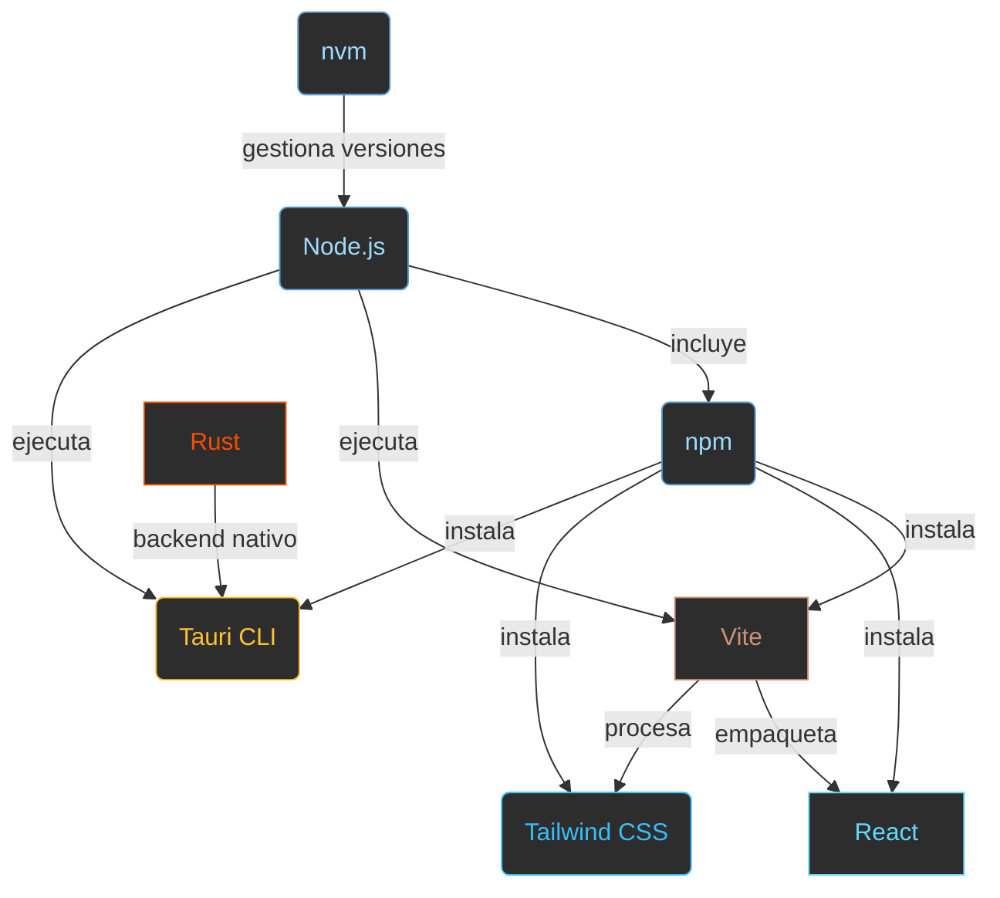

# Sesión 0: Fundamentos de Arquitectura y Configuración del Entorno

Node.js, NPM, Vite, React, Tailwind CSS, Rust y Tauri

[← Volver al Índice](../README.md#5-distribución-temporal-y-contenidos-s00s13)

---

## Tauri vs Electron: ¿Por qué Tauri?

### ¿Qué es Tauri?

Tauri es un *framework*(estructura o plantilla de trabajo que impone reglas de arquitectura) de código abierto para crear aplicaciones de escritorio usando tecnologías web en el frontend (HTML, CSS, JavaScript/TypeScript) y un backend nativo escrito en Rust. A diferencia de Electron, que incluye un navegador completo (Chromium) en cada aplicación, Tauri se apoya en el **WebView nativo** del sistema operativo (Edge WebView2 en Windows, WebKit en macOS/Linux), lo que lo hace extremadamente ligero.

> **Arquitectura Tauri:** Frontend (React/Vue/Svelte) se ejecuta en el WebView del SO → se comunica con el backend Rust a través de un canal IPC seguro → el backend accede al sistema de archivos, base de datos, etc. de forma controlada.

### ¿Por qué elegir Tauri sobre Electron?

| Criterio |  Tauri |  Electron |
| --- | --- | --- |
| **Backend** | Rust (nativo, rápido, seguro en memoria) | Node.js (JavaScript, single-threaded) |
| **Tamaño del bundle** | ~2-5 MB (usa el WebView del sistema) | ~80-200 MB (incluye Chromium completo) |
| **Memoria RAM** | ~30-50 MB en idle | ~100-200 MB en idle (Chromium) |
| **Rendimiento** | Empaquetado nativo, arranque rápido | Empaquetado con V8, más pesado |
| **Seguridad** | Permisos explícitos, sandbox estricto | Node.js tiene acceso amplio al SO |
| **Frontend** | Cualquier framework web (React, Vue, Svelte...) | Cualquier framework web (React, Vue, Svelte...) |
| **Soporte SO** | Windows, macOS, Linux | Windows, macOS, Linux |
| **Comunidad** | Creciente rápido, respaldado por empresa | Madura, amplia documentación |
| **Ejemplos** | Cap, GitButler, Ente, etc. | VS Code, Discord, Slack, Figma, Notion, Spotify, etc. |

> **En resumen:** Tauri es más ligero, más rápido y más seguro que Electron. La diferencia principal es que Tauri usa el WebView nativo del sistema operativo mientras que Electron incluye Chromium completo, lo que explica la gran diferencia en tamaño y memoria.

> **Nota:** Electron sigue siendo una opción válida para aplicaciones que necesitan el máximo control sobre el rendering (apps que necesitan controlar como pintar hasta el último píxel, y al llevar un navegador integrado, esto es más sencillo). Pero para la mayoría de aplicaciones de escritorio, Tauri ofrece mejor rendimiento con menos recursos.

## Ejemplo de miniaplicación

Una forma muy efectiva de ir adquiriendo los conocimientos es mediante la creación de una miniaplicación libre de acceso a base de datos. Pero antes, hay que entender el flujo de datos en React/Tauri:

### 1) Arquitectura de escritorio (Tauri)

**Ejemplificación (resumen visual):**



**Detalle (ida y vuelta — qué ocurre en cada paso):**



> 💡 **Qué ocurre en cada momento (el ciclo completo — ida y vuelta):**
>
> 1. **React envía un JSON.** Al llamar `invoke("saludar", { nombre: "Ana" })`, el objeto de argumentos (`{ nombre: "Ana" }`) se **serializa a JSON** (JavaScript ya lo maneja como objetos; el puente lo convierte al formato que va a Rust).
> 2. **Invoke lo deserializa.** El *bridge* de Tauri (Tauri Core) **deserializa ese JSON** a los tipos esperados por el comando Rust y valida que coincidan (nombre → `String`).
> 3. **Tauri procesa.** Invoca la función Rust correspondiente (`#[tauri::command]`) y devuelve el resultado.
> 4. **Rust lo serializa.** El resultado del comando (p. ej. `"Hola, Ana!"`) se **serializa a JSON** mediante `serde` (`Serializar`/`Deserialize`), que es quien pasa de un tipo Rust a JSON y viceversa.
> 5. **Invoke lo deserializa (de vuelta).** El bridge **deserializa el JSON** del retorno y lo tipa como el genérico `invoke<T>` que pediste (aquí `Promise<string>`).
> 6. **React recibe el dato tipado.** Tu `await invoke<T>` resuelve con el valor ya tipado y lo usas en la UI.
>
> **Regla mnemotécnica:** *React serializa* (objeto→JSON), *Tauri/invoke deserializa* (JSON→Rust), *Rust procesa*, *Rust serializa* (resultado→JSON), *invoke deserializa* (JSON→T), *React consume*. **`serde`** es quien hace la serialización en el lado Rust; la API **`invoke`** de Tauri hace el puente en el lado JS.

---

### 2) Arquitectura web (Spring Boot + MySQL en Docker)

A continuación se muestra una miniaplicación de ejemplo que sigue esta arquitectura:> **Arquitectura:** Backend (SpringBoot + MySQL en Docker) → API REST → Frontend (React + Vite) → Empaquetado como app de escritorio (Tauri). La misma base de código sirve para la versión web y la versión de escritorio.





**Figura.** API REST SpringBoot (acceso a MySQL bajo Docker)


Web expuesta por Vite


App de Escritorio


App de Escritorio con ventana emergente de inserción

> **Profe:** Lanzamos desde WSL docker, el backend y finalmente el frontend tanto en WSL como en Windows(instrucciones en README.md)

## Mapa de Relaciones del Ecosistema

Diagrama que muestra cómo se relacionan las herramientas del entorno de desarrollo:

> **nvm** — el que instala y cambia entre versiones de Node
> **Node.js** — el motor que ejecuta JavaScript/TypeScript fuera del navegador
> **npm** — el gestor que instala librerías y herramientas
> **Vite** — el empaquetador que compila y sirve el frontend en caliente
> **React** — la librería de componentes para la interfaz de usuario
> **Tailwind CSS** — el framework de estilos con clases utilitarias
> **Tauri CLI** — la herramienta que envuelve la web en una ventana nativa
> **Rust** — el lenguaje detrás del backend nativo de Tauri



> [!NOTE]
> Los siguientes apartados (Node.js, npm, TypeScript, Vite, React) son una **visión general** del ecosistema que usaremos. No es necesario instalar ni configurar nada todavía: la instalación del entorno se hará en la **Sesión 01** (según tu SO) y la guía operativa (nvm, npm, `tsconfig.json`, Vite) en el apunte **10 · Node.js, npm y Vite en TypeScript**.

## Node.js: Entorno de Ejecución

Node.js es un entorno de ejecución de JavaScript/TypeScript basado en el motor V8 de Chrome. Permite ejecutar JavaScript/TypeScript fuera del navegador, necesario para las herramientas de desarrollo.

```bash
# Verificar instalacion de Node.js
node --version   # Output: v24.x.x
npm --version    # Output: 11.x.x
```

## NPM y Gestión de Paquetes

Node.js incluye npm (Node Package Manager), el gestor de paquetes más grande del ecosistema JavaScript/TypeScript. Permite instalar, actualizar y gestionar dependencias de forma declarativa.

- `package.json` es el corazón de cualquier proyecto Node: contiene metadatos, scripts y dependencias.
- Las dependencias de ejecución van en `dependencies` y las herramientas de desarrollo en `devDependencies`.
- Los scripts se ejecutan con `npm run <nombre>` (p. ej. `dev`, `build`).
- **nvm** permite instalar y cambiar entre versiones de Node; este curso usa **Node 24** (que ejecuta TypeScript directamente borrando los tipos, sin transpilar).

> 🌐 La **guía operativa completa** (crear un proyecto, `npm init`, instalar paquetes, scripts, `nvm`, y cómo configurar el canónico de `tsconfig.json`) está en el apunte **10 · Node.js, npm y Vite en TypeScript** → [`apuntes/s03/10_NPM.md`](apuntes/s03/10_NPM.md).

## Vite: Empaquetador Moderno

Vite proporciona un servidor de desarrollo con recarga instantánea (HMR) y empaquetado optimizado para producción.

```bash
# Crear proyecto con Vite
npm create vite@latest mi-app -- --template react-ts
```

> 🌐 Paso a paso en el capítulo de Vite de **10 · Node.js, npm y Vite** → [`apuntes/s03/10_NPM.md`](apuntes/s03/10_NPM.md) (`npm create`, estructura, `dev`, `build`).

### Configuración de Vite (vite.config.ts)

```typescript
import { defineConfig } from "vite";
import react from "@vitejs/plugin-react";

export default defineConfig({
  plugins: [react()],
  server: {
    port: 5173,
    open: true,
  },
  build: {
    outDir: "dist",
    sourcemap: true,
  },
});
```

## React: Librería de Interfaces

React permite construir interfaces de usuario mediante componentes reutilizables con estado propio.

```tsx
// App.tsx - Componente básico
import { useState } from 'react';

function App() {
    const [count, setCount] = useState(0);

    return (
        <div>
            <h1>Contador: {count}</h1>
            <button onClick={() => setCount(count + 1)}>
                Incrementar
            </button>
        </div>
    );
}

export default App;
```

## Tailwind CSS: Framework Utilitario

Tailwind CSS permite diseñar interfaces rapidamente usando clases predefinidas directamente en el JSX.

```tsx
// Instalacion
npm install -D tailwindcss postcss autoprefixer
npx tailwindcss init -p

// tailwind.config.js
export default {
    content: ["./index.html", "./src/**/*.{js,ts,jsx,tsx}"],
    theme: { extend: {} },
    plugins: [],
};

// index.css
@tailwind base;
@tailwind components;
@tailwind utilities;

// Uso en componente
function Tarjeta() {
    return (
        <div className="bg-white shadow-lg rounded-xl p-6 hover:shadow-xl transition">
            <h2 className="text-xl font-bold text-gray-800">Titulo</h2>
            <p className="text-gray-600 mt-2">Contenido de la tarjeta.</p>
        </div>
    );
}
```

## Rust: Lenguaje de Sistema

Rust es el lenguaje que impulsa el backend de Tauri. Destaca por su seguridad de memoria sin necesidad de recolector de basura.

### Verificar instalación

```bash
rustc --version
# rustc 1.XX.X (xxxx 2026-XX-XX)

cargo --version
# cargo 1.XX.X (xxxx 2026-XX-XX)
```

> [!NOTE]
> Si no tienes Rust instalado, visita [rustup.rs](https://rustup.rs) y sigue las instrucciones.

### Ejemplo: Hola mundo

```bash
# Crear proyecto con Cargo
cargo new hola-rust
cd hola-rust
```

Abre `src/main.rs` y sustituye su contenido por:

```rust
fn main() {
    println!("Hola desde Rust!");

    let mensaje = "Tauri usa Rust";
    println!("Mensaje: {}", mensaje);
}
```

```bash
# Ejecutar
cargo run
```

```
   Compiling hola-rust v0.1.0
    Finished dev [unoptimized + debuginfo] target(s)
     Running `target/debug/hola-rust`
Hola desde Rust!
Mensaje: Tauri usa Rust
```

## Tauri: El Puente

Tauri conecta el frontend web con el sistema operativo a través de Rust, ofreciendo aplicaciones de escritorio nativas, seguras y ligeras.

### Estructura de Tauri

```
src-tauri/
  Cargo.toml          # Dependencias Rust del proyecto Tauri
  tauri.conf.json     # Configuración de la aplicacion (ventana, permisos, etc.)
  capabilities/       # Permisos de la aplicacion
  src/
    main.rs           # Punto de entrada (Windows, macOS, Linux)
    lib.rs            # Logica principal de Tauri
```

### Comandos Tauri principales

```bash
# Ejecutar en modo desarrollo (ventana nativa + HMR)
npx tauri dev

# Compilar para producción
npx tauri build

# El binario generado estara en:
# src-tauri/target/release/tauri-ipc-filesystem
```

### Ejemplo: Comando personalizado Rust + invocación TypeScript

`src-tauri/src/lib.rs`:

> 📦 **Este código está en el repositorio:** `repos/03-tauri-ipc-filesystem/src-tauri/src/lib.rs`

```rust
use std::fs;
use tauri::Manager;

#[tauri::command]
fn greet(name: &str) -> String {
    format!("Hola desde Rust, {}!", name)
}

#[tauri::command]
fn saludar(nombre: &str) -> String {
    format!("Hola, {}! Bienvenido a Tauri.", nombre)
}

#[tauri::command]
fn sumar(a: i32, b: i32) -> i32 {
    a + b
}

#[tauri::command]
fn obtener_info_sistema() -> Result<String, String> {
    let os = std::env::consts::OS;
    let arch = std::env::consts::ARCH;
    Ok(format!("SO: {}, Arquitectura: {}", os, arch))
}

#[tauri::command]
fn leer_archivo(ruta: String) -> Result<String, String> {
    fs::read_to_string(&ruta).map_err(|e| e.to_string())
}

#[tauri::command]
fn escribir_archivo(ruta: String, contenido: String) -> Result<(), String> {
    fs::write(&ruta, &contenido).map_err(|e| e.to_string())
}

#[tauri::command]
fn listar_directorio(ruta: String) -> Result<Vec<String>, String> {
    let entries = fs::read_dir(&ruta).map_err(|e| e.to_string())?;
    let mut archivos = Vec::new();
    for entry in entries {
        let entry = entry.map_err(|e| e.to_string())?;
        archivos.push(entry.file_name().to_string_lossy().to_string());
    }
    Ok(archivos)
}

#[cfg_attr(mobile, tauri::mobile_entry_point)]
pub fn run() {
    tauri::Builder::default()
        .invoke_handler(tauri::generate_handler![
            greet,
            saludar,
            sumar,
            obtener_info_sistema,
            leer_archivo,
            escribir_archivo,
            listar_directorio
        ])
        .run(tauri::generate_context!())
        .expect("error al ejecutar Tauri");
}
```

Llamar al comando desde TypeScript:

```typescript
import { invoke } from '@tauri-apps/api/core'

const mensaje = await invoke('saludar', { nombre: 'Estudiante' })
console.log(mensaje) // "Hola desde Rust, Estudiante!"
```

---

[Índice](../README.md#5-distribución-temporal-y-contenidos-s00s13) [S0](sesion00.md) [S1](sesion01.md) [S2](sesion02.md) [S3](sesion03.md) [S4](sesion04.md) [S5](sesion05.md) [S6](sesion06.md) [S7](sesion07.md) [S8](sesion08.md) [S9](sesion09.md) [S10](sesion10.md) [S11](sesion11.md) [S12](sesion12.md) [S13](sesion13.md)
